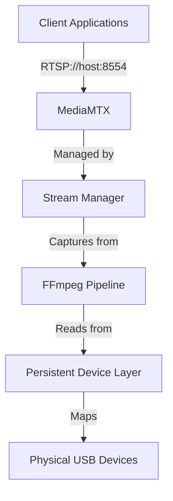

# LyreBirdAudio Documentation Implementation Plan

## Document Status

**Created:** 2025-11-15
**Target Platform:** Cloudflare Pages
**Documentation Framework:** MkDocs Material
**Source Repository:** https://github.com/tomtom215/LyreBirdAudio
**Documentation Repository:** https://github.com/tomtom215/LyreBird-Docs

## Executive Summary

This plan details the implementation of a static documentation site for LyreBirdAudio using MkDocs with the Material theme, hosted on Cloudflare Pages at no cost. The solution provides professional documentation with dark mode, full-text search, responsive design, and automatic deployment.

### Technical Stack

**Static Site Generator:** MkDocs 1.6+ with Material theme 9.7.0
**Hosting Platform:** Cloudflare Pages (Free Tier)
**Build Environment:** Python 3.11
**Source Control:** Git/GitHub
**Deployment:** Automatic via GitHub integration

### Why MkDocs Material

- Purpose-built for technical documentation
- Zero-configuration search functionality
- Native dark mode support with system preference detection
- Markdown-based content (simple editing workflow)
- Active maintenance and comprehensive plugin ecosystem
- Superior navigation structure for technical content
- Python ecosystem (simpler than Ruby/Jekyll)

### Cloudflare Pages Free Tier Specifications

**Builds:** 500 per month (account-wide limit)
**Bandwidth:** Unlimited
**Requests:** Unlimited
**Sites:** Unlimited
**Custom Domains:** 100 per project
**SSL/TLS:** Automatic provisioning and renewal
**Build Time:** 20 minutes per build
**Concurrent Builds:** 1 per account

**Commercial Use:** Permitted
**Credit Card:** Not required
**Expiration:** None

---

## Phase 1: Development Environment Setup

### 1.1 System Requirements

**Operating System:** Linux, macOS, or Windows (WSL2)
**Python:** 3.8 or higher (3.11 recommended)
**Git:** 2.0 or higher
**Disk Space:** 500MB minimum

### 1.2 Verify Prerequisites

```bash
# Verify Python version
python3 --version
# Requirement: 3.8+, Recommended: 3.11

# Verify pip
python3 -m pip --version

# Verify git
git --version
# Requirement: 2.0+
```

### 1.3 Install Python Dependencies

**Ubuntu/Debian:**
```bash
sudo apt-get update
sudo apt-get install python3-pip python3-venv git
```

**macOS:**
```bash
brew install python3 git
```

### 1.4 Create Virtual Environment

```bash
# Create virtual environment
python3 -m venv venv

# Activate virtual environment
source venv/bin/activate  # Linux/macOS
# venv\Scripts\activate   # Windows
```

### 1.5 Install MkDocs and Dependencies

```bash
# Install core packages
pip install mkdocs==1.6.1
pip install mkdocs-material==9.7.0

# Install recommended plugins
pip install mkdocs-minify-plugin==0.8.0
pip install pymdown-extensions==10.11.2

# Generate requirements file for Cloudflare Pages
pip freeze > requirements.txt
```

### 1.6 Verify Installation

```bash
mkdocs --version
# Expected output: mkdocs, version 1.6.1 (or higher)

python -c "import material; print(material.__version__)"
# Expected output: 9.7.0 (or higher)
```

---

## Phase 2: MkDocs Project Initialization

### 2.1 Initialize Project Structure

```bash
# Initialize MkDocs project
mkdocs new .

# This creates:
# docs/
# ├── index.md
# mkdocs.yml
```

### 2.2 Create Directory Structure

```bash
# Create documentation directory structure
mkdir -p docs/{getting-started,user-guide,components,advanced,reference,maintenance,contributing,about}
mkdir -p docs/assets
mkdir -p docs/stylesheets
mkdir -p docs/javascripts
```

**Final Structure:**
```
docs/
├── index.md
├── getting-started/
├── user-guide/
├── components/
├── advanced/
├── reference/
├── maintenance/
├── contributing/
├── about/
├── assets/
├── stylesheets/
└── javascripts/
```

### 2.3 Configure mkdocs.yml

Create the primary configuration file at project root:

```yaml
# Site Metadata
site_name: LyreBirdAudio Documentation
site_url: https://lyrebird-docs.pages.dev
site_description: Production-hardened RTSP audio streaming suite for USB microphones with 24/7 reliability
site_author: Tom F
repo_url: https://github.com/tomtom215/LyreBirdAudio
repo_name: tomtom215/LyreBirdAudio
edit_uri: blob/main/

# Copyright
copyright: Copyright &copy; 2024 LyreBirdAudio Contributors - Apache 2.0 License

# Theme Configuration
theme:
  name: material
  language: en

  # Color Palette - Dark Mode Default
  palette:
    # Dark mode (default)
    - media: "(prefers-color-scheme: dark)"
      scheme: slate
      primary: indigo
      accent: indigo
      toggle:
        icon: material/brightness-4
        name: Switch to light mode

    # Light mode (optional)
    - media: "(prefers-color-scheme: light)"
      scheme: default
      primary: indigo
      accent: indigo
      toggle:
        icon: material/brightness-7
        name: Switch to dark mode

  # Features
  features:
    - announce.dismiss
    - content.action.edit
    - content.action.view
    - content.code.annotate
    - content.code.copy
    - content.tabs.link
    - content.tooltips
    - navigation.expand
    - navigation.footer
    - navigation.indexes
    - navigation.instant
    - navigation.instant.prefetch
    - navigation.instant.progress
    - navigation.path
    - navigation.sections
    - navigation.tabs
    - navigation.tabs.sticky
    - navigation.top
    - navigation.tracking
    - search.highlight
    - search.share
    - search.suggest
    - toc.follow

  # Icons
  icon:
    repo: fontawesome/brands/github
    edit: material/pencil
    view: material/eye

# Plugins
plugins:
  - search:
      separator: '[\s\-,:!=\[\]()"/]+|(?!\b)(?=[A-Z][a-z])|\.(?!\d)|&[lg]t;'
  - minify:
      minify_html: true
      minify_js: true
      minify_css: true
      htmlmin_opts:
        remove_comments: true
      cache_safe: true

# Extensions
markdown_extensions:
  # Python Markdown
  - abbr
  - admonition
  - attr_list
  - def_list
  - footnotes
  - md_in_html
  - toc:
      permalink: true
      title: On this page
      toc_depth: 3

  # PyMdown Extensions
  - pymdownx.arithmatex:
      generic: true
  - pymdownx.betterem:
      smart_enable: all
  - pymdownx.caret
  - pymdownx.details
  - pymdownx.emoji:
      emoji_index: !!python/name:material.extensions.emoji.twemoji
      emoji_generator: !!python/name:material.extensions.emoji.to_svg
  - pymdownx.highlight:
      anchor_linenums: true
      line_spans: __span
      pygments_lang_class: true
  - pymdownx.inlinehilite
  - pymdownx.keys
  - pymdownx.mark
  - pymdownx.smartsymbols
  - pymdownx.superfences:
      custom_fences:
        - name: mermaid
          class: mermaid
          format: !!python/name:pymdownx.superfences.fence_code_format
  - pymdownx.tabbed:
      alternate_style: true
  - pymdownx.tasklist:
      custom_checkbox: true
  - pymdownx.tilde

# Navigation Structure
nav:
  - Home: index.md

  - Getting Started:
    - Quick Start: getting-started/quick-start.md
    - System Requirements: getting-started/system-requirements.md
    - Installation: getting-started/installation.md
    - Basic Usage: getting-started/basic-usage.md

  - User Guide:
    - Configuration: user-guide/configuration.md
    - USB Device Management: user-guide/usb-device-management.md
    - Stream Management: user-guide/stream-management.md
    - MediaMTX Integration: user-guide/mediamtx-integration.md
    - Multiplex Streaming: user-guide/multiplex-streaming.md

  - Components:
    - Overview: components/index.md
    - Orchestrator: components/orchestrator.md
    - Stream Manager: components/stream-manager.md
    - USB Audio Mapper: components/usb-audio-mapper.md
    - Capability Checker: components/capability-checker.md
    - Diagnostics Tool: components/diagnostics.md
    - Version Manager: components/version-manager.md
    - MediaMTX Installer: components/installer.md

  - Advanced:
    - Architecture: advanced/architecture.md
    - Performance Tuning: advanced/performance.md
    - Troubleshooting: advanced/troubleshooting.md
    - Diagnostics & Monitoring: advanced/diagnostics-monitoring.md
    - Custom Integration: advanced/custom-integration.md

  - Reference:
    - Configuration Files: reference/configuration-files.md
    - Environment Variables: reference/environment-variables.md
    - Command Reference: reference/command-reference.md
    - Exit Codes: reference/exit-codes.md
    - Log Files: reference/log-files.md

  - Maintenance:
    - Version Management: maintenance/version-management.md
    - Backup & Restore: maintenance/backup-restore.md
    - Uninstallation: maintenance/uninstallation.md

  - Contributing:
    - Overview: contributing/index.md
    - Development Setup: contributing/development-setup.md
    - Code Standards: contributing/code-standards.md
    - Testing: contributing/testing.md

  - About:
    - Features: about/features.md
    - System Overview: about/system-overview.md
    - Project Origin: about/project-origin.md
    - License: about/license.md

# Extra Configuration
extra:
  social:
    - icon: fontawesome/brands/github
      link: https://github.com/tomtom215/LyreBirdAudio
      name: GitHub Repository
    - icon: fontawesome/solid/bug
      link: https://github.com/tomtom215/LyreBirdAudio/issues
      name: Report Issues
    - icon: fontawesome/solid/comments
      link: https://github.com/tomtom215/LyreBirdAudio/discussions
      name: Discussions

# Custom CSS
extra_css:
  - stylesheets/extra.css
```

**Key Configuration Notes:**

1. **Dark Mode Default:** The `palette` configuration lists dark mode first with `prefers-color-scheme: dark`
2. **Search:** Zero-configuration full-text search included
3. **Navigation:** Tabs for top-level sections, expandable sidebar
4. **Code Blocks:** Syntax highlighting with copy button
5. **Mermaid Diagrams:** For architecture visualizations

---

## Phase 3: Content Migration Strategy

### 3.1 Source Content Analysis

**Source File:** `/tmp/lyrebird-source/README.md` (2267 lines)
**Target:** Structured documentation with 40+ pages

**Content Sections Identified:**
1. Quick Start (lines 41-67)
2. Features & Capabilities (lines 71-117)
3. System Overview (lines 120-243)
4. System Requirements (lines 246-307)
5. Installation (lines 309-402)
6. Basic Usage (lines 404-473)
7. Configuration Guide (lines 475-714)
8. MediaMTX Integration (lines 716-785)
9. Troubleshooting (lines 787-1012)
10. Diagnostics & Monitoring (lines 1017-1136)
11. Version Management (lines 1140-1235)
12. Performance & Optimization (lines 1237-1379)
13. Architecture & Design (lines 1381-1411)
14. Component Reference (lines 1415-1834)
15. Advanced Topics (lines 1836-1925)
16. Uninstallation & Cleanup (lines 1928-2103)
17. Development & Contributing (lines 2106-2211)
18. License & Credits (lines 2214-2266)

### 3.2 Content Extraction Plan

**Step 1: Extract README sections**
```bash
# Copy source README for reference
cp /tmp/lyrebird-source/README.md /tmp/README-source.md
```

**Step 2: Split into logical pages**

Map README sections to documentation pages:

| README Section | Documentation Page |
|----------------|-------------------|
| Quick Start | `getting-started/quick-start.md` |
| System Requirements | `getting-started/system-requirements.md` |
| Installation | `getting-started/installation.md` |
| Basic Usage | `getting-started/basic-usage.md` |
| Configuration Guide | `user-guide/configuration.md` |
| MediaMTX Integration | `user-guide/mediamtx-integration.md` |
| Multiplex Streaming (from Config) | `user-guide/multiplex-streaming.md` |
| USB Mapper (Component) | `user-guide/usb-device-management.md` |
| Orchestrator (Component) | `components/orchestrator.md` |
| Stream Manager (Component) | `components/stream-manager.md` |
| USB Audio Mapper (Component) | `components/usb-audio-mapper.md` |
| Capability Checker (Component) | `components/capability-checker.md` |
| Diagnostics (Component) | `components/diagnostics.md` |
| Version Manager (Component) | `components/version-manager.md` |
| MediaMTX Installer (Component) | `components/installer.md` |
| Architecture & Design | `advanced/architecture.md` |
| Performance & Optimization | `advanced/performance.md` |
| Troubleshooting | `advanced/troubleshooting.md` |
| Diagnostics & Monitoring | `advanced/diagnostics-monitoring.md` |
| Advanced Topics | `advanced/custom-integration.md` |
| Configuration Files (extracted) | `reference/configuration-files.md` |
| Environment Variables (extracted) | `reference/environment-variables.md` |
| Exit Codes (extracted) | `reference/exit-codes.md` |
| Log Files (extracted) | `reference/log-files.md` |
| Version Management | `maintenance/version-management.md` |
| Backup & Restore (from Advanced) | `maintenance/backup-restore.md` |
| Uninstallation & Cleanup | `maintenance/uninstallation.md` |
| Development & Contributing | `contributing/development-setup.md` |
| Code Standards (extracted) | `contributing/code-standards.md` |
| Testing (extracted) | `contributing/testing.md` |
| Features & Capabilities | `about/features.md` |
| System Overview | `about/system-overview.md` |
| Project Origin | `about/project-origin.md` |
| License & Credits | `about/license.md` |

### 3.3 Content Enhancement Guidelines

**Markdown Enhancements:**

1. **Admonitions** for important information:
```markdown
!!! note "Production Recommendation"
    Use tagged releases for maximum stability. The main branch may contain work-in-progress features.

!!! warning "USB Device Limitations"
    Raspberry Pi devices support maximum 2 USB microphones due to bandwidth constraints.

!!! danger "Critical Configuration"
    For production deployments, you MUST install the stream manager as a systemd service.

!!! tip "Hardware Recommendation"
    Intel N100/N150 Mini PCs provide more reliable USB architecture without shared bandwidth issues.
```

2. **Code Tabs** for multi-platform commands:
```markdown
=== "Ubuntu/Debian"
    ```bash
    sudo apt-get install ffmpeg alsa-utils
    ```

=== "Arch Linux"
    ```bash
    sudo pacman -S ffmpeg alsa-utils
    ```

=== "macOS"
    ```bash
    brew install ffmpeg
    ```
```

3. **Mermaid Diagrams** for architecture:
```markdown

```

4. **Tables** for structured data:
```markdown
| Script | Version | Purpose |
|--------|---------|---------|
| lyrebird-orchestrator.sh | 2.1.0 | Unified management interface |
| mediamtx-stream-manager.sh | 1.4.1 | Stream lifecycle management |
```

### 3.4 Homepage Design

**Structure for `docs/index.md`:**

```markdown
# LyreBirdAudio

Production-hardened RTSP audio streaming suite for USB microphones with 24/7 reliability.

Transform USB microphones into reliable RTSP streams for continuous monitoring and recording. Built on MediaMTX with automatic recovery, device persistence, and comprehensive diagnostics for unattended operation.

## Quick Start

[Get Started](getting-started/quick-start.md){ .md-button .md-button--primary }
[View on GitHub](https://github.com/tomtom215/LyreBirdAudio){ .md-button }

## Key Features

**No Configuration Guesswork**
: Automatically detects hardware capabilities

**Survives Reboots**
: USB devices maintain consistent names via udev rules

**Self-Healing**
: Automatic recovery from crashes and failures

**Easy Updates**
: Git-based version management with rollback capability

**Production-Ready**
: Designed for unattended 24/7 operation

## System Architecture

[Architecture diagram with Mermaid]

## Platform Support

Linux (Ubuntu/Debian/Raspberry Pi OS) - x86_64, ARM64, ARMv7, ARMv6

## License

Apache 2.0 - See [License](about/license.md) for details.
```

---

## Phase 4: Local Development and Testing

### 4.1 Start Development Server

```bash
# Ensure virtual environment is active
source venv/bin/activate

# Start development server with live reload
mkdocs serve

# Server starts on http://127.0.0.1:8000
# Watches for file changes and auto-reloads browser
```

**Development Server Options:**
```bash
# Custom host and port
mkdocs serve --dev-addr=0.0.0.0:8080

# Verbose output
mkdocs serve --verbose

# Strict mode (warnings as errors)
mkdocs serve --strict
```

### 4.2 Testing Checklist

**Navigation:**
- [ ] All pages accessible from navigation
- [ ] Table of contents generates correctly
- [ ] Search functionality works
- [ ] Navigation tabs display properly
- [ ] Mobile navigation functions correctly

**Content:**
- [ ] All code blocks have syntax highlighting
- [ ] Admonitions render correctly
- [ ] Mermaid diagrams display
- [ ] Tables format properly
- [ ] Internal links resolve
- [ ] External links open in new tabs

**Appearance:**
- [ ] Dark mode default loads correctly
- [ ] Light/dark mode toggle functions
- [ ] System preference detection works
- [ ] Custom CSS applies
- [ ] Responsive design on mobile devices
- [ ] Icons display correctly

**Search:**
- [ ] Search bar appears
- [ ] Search results accurate
- [ ] Search highlighting works
- [ ] Search keyboard shortcuts function

**Performance:**
- [ ] Pages load quickly
- [ ] No console errors
- [ ] Images optimized
- [ ] Build completes without errors

### 4.3 Build Static Site

```bash
# Build production-ready static site
mkdocs build

# Output directory: site/
# Contains all static HTML, CSS, JS, assets
```

**Build Options:**
```bash
# Clean build (remove previous build)
mkdocs build --clean

# Strict mode (fail on warnings)
mkdocs build --strict

# Verbose output
mkdocs build --verbose
```

**Verify Build Output:**
```bash
# Check build directory
ls -la site/

# Expected structure:
# site/
# ├── index.html
# ├── getting-started/
# ├── user-guide/
# ├── components/
# ├── assets/
# ├── search/
# └── sitemap.xml

# Test built site locally
cd site
python3 -m http.server 8001
# Visit http://localhost:8001
```

### 4.4 Validation Tools

**Link Checking:**
```bash
# Install link checker
pip install linkchecker

# Check all links
linkchecker http://localhost:8000
```

**HTML Validation:**
```bash
# Check generated HTML
find site -name "*.html" -exec echo "Checking {}" \; -exec tidy -q -e {} \;
```

---

## Phase 5: Repository Configuration

### 5.1 Create .gitignore

```gitignore
# Python
venv/
__pycache__/
*.py[cod]
*$py.class
.Python
*.so
.eggs/
*.egg-info/
dist/
build/

# MkDocs
site/
.cache/

# IDE
.vscode/
.idea/
*.swp
*.swo
*~

# OS
.DS_Store
Thumbs.db
.DS_Store?
._*
.Spotlight-V100
.Trashes

# Environment
.env
.env.local

# Logs
*.log

# Temporary files
*.tmp
*.bak
*.orig
```

### 5.2 Create README.md for Documentation Repository

```markdown
# LyreBirdAudio Documentation

Official documentation site for [LyreBirdAudio](https://github.com/tomtom215/LyreBirdAudio).

## Built With

- [MkDocs](https://www.mkdocs.org/) - Static site generator
- [Material for MkDocs](https://squidfunk.github.io/mkdocs-material/) - Documentation theme
- [Cloudflare Pages](https://pages.cloudflare.com/) - Hosting platform

## Local Development

### Prerequisites

- Python 3.8 or higher
- pip
- git

### Setup

```bash
# Clone repository
git clone https://github.com/tomtom215/LyreBird-Docs.git
cd LyreBird-Docs

# Create virtual environment
python3 -m venv venv
source venv/bin/activate

# Install dependencies
pip install -r requirements.txt

# Start development server
mkdocs serve
```

Access the site at http://127.0.0.1:8000

### Build

```bash
# Build static site
mkdocs build

# Output in site/ directory
```

## Deployment

This site is automatically deployed to Cloudflare Pages on every push to the `main` branch.

**Live Site:** https://lyrebird-docs.pages.dev

## Project Structure

```
.
├── docs/                    # Documentation source files
│   ├── index.md            # Homepage
│   ├── getting-started/    # Getting started guides
│   ├── user-guide/         # User documentation
│   ├── components/         # Component reference
│   ├── advanced/           # Advanced topics
│   ├── reference/          # Reference documentation
│   ├── maintenance/        # Maintenance guides
│   ├── contributing/       # Contribution guidelines
│   └── about/              # About the project
├── mkdocs.yml              # MkDocs configuration
├── requirements.txt        # Python dependencies
└── README.md               # This file
```

## Contributing

See [Contributing Guidelines](https://lyrebird-docs.pages.dev/contributing/) for details on submitting documentation improvements.

## License

Apache 2.0 - See [LICENSE](LICENSE) for details.
```

### 5.3 Copy License File

```bash
# Copy Apache 2.0 license from source repository
cp /tmp/lyrebird-source/LICENSE ./LICENSE
```

---

## Phase 6: GitHub Repository Setup

### 6.1 Create GitHub Repository

**Via GitHub Web Interface:**

1. Navigate to https://github.com/new
2. Repository name: `LyreBird-Docs`
3. Description: "Documentation for LyreBirdAudio - RTSP audio streaming suite"
4. Visibility: Public
5. **Do NOT initialize** with README, .gitignore, or license
6. Click "Create repository"

### 6.2 Push Local Repository

```bash
# Initialize git (if not already done)
git init

# Add all files
git add .

# Initial commit
git commit -m "Initial commit: MkDocs Material documentation site

- Configure MkDocs with Material theme 9.7.0
- Setup dark mode as default
- Create navigation structure
- Add .gitignore and README
- Prepare for Cloudflare Pages deployment"

# Add remote repository
git remote add origin https://github.com/tomtom215/LyreBird-Docs.git

# Push to GitHub
git branch -M main
git push -u origin main
```

### 6.3 Verify Repository

```bash
# Verify remote
git remote -v

# Expected output:
# origin  https://github.com/tomtom215/LyreBird-Docs.git (fetch)
# origin  https://github.com/tomtom215/LyreBird-Docs.git (push)

# Check repository status
git status

# Expected output:
# On branch main
# Your branch is up to date with 'origin/main'.
# nothing to commit, working tree clean
```

---

## Phase 7: Cloudflare Pages Deployment

### 7.1 Create Cloudflare Account

**If you don't have a Cloudflare account:**

1. Navigate to https://dash.cloudflare.com/sign-up
2. Enter email address
3. Create password (minimum 8 characters)
4. Verify email address
5. Complete account setup

**No credit card required for free tier**

### 7.2 Connect GitHub Repository

**In Cloudflare Dashboard:**

1. Click "Workers & Pages" in left sidebar
2. Click "Create application"
3. Select "Pages" tab
4. Click "Connect to Git"
5. Click "Connect GitHub"
6. Authorize Cloudflare Pages application:
   - Click "Authorize Cloudflare Pages"
   - Authenticate with GitHub if prompted
7. Select repository access:
   - Choose "Only select repositories"
   - Select `LyreBird-Docs` from dropdown
   - Click "Install & Authorize"

### 7.3 Configure Build Settings

**Project Configuration:**

| Setting | Value |
|---------|-------|
| Project name | `lyrebird-docs` |
| Production branch | `main` |
| Framework preset | MkDocs |
| Build command | `pip install -r requirements.txt && mkdocs build` |
| Build output directory | `site` |

**Important:** The build command must explicitly install dependencies because Cloudflare Pages does not automatically install from requirements.txt.

**Environment Variables:**

Click "Environment variables (advanced)" and add:

| Variable Name | Value | Production | Preview |
|---------------|-------|------------|---------|
| `PYTHON_VERSION` | `3.11` | ✓ | ✓ |

**Why specify PYTHON_VERSION:**
- Cloudflare Pages default is Python 3.7
- MkDocs Material requires Python 3.8+
- Python 3.11 provides optimal stability and performance
- Ensures consistent builds

### 7.4 Deploy Site

1. Click "Save and Deploy"
2. Cloudflare Pages will:
   - Clone repository
   - Install Python 3.11
   - Execute: `pip install -r requirements.txt`
   - Execute: `mkdocs build`
   - Deploy `site/` directory to CDN
   - Generate deployment URL

**First deployment typically takes 2-5 minutes**

### 7.5 Access Deployed Site

After successful deployment:

1. Deployment URL: `https://lyrebird-docs.pages.dev`
2. Click "Visit site" to view live documentation
3. Verify:
   - Dark mode loads by default
   - Navigation works correctly
   - Search functions
   - All pages render correctly

**Deployment Status Indicators:**

- Building: Yellow indicator, "Building"
- Success: Green indicator, "Success"
- Failure: Red indicator, "Failed" (check build logs)

### 7.6 Deployment Monitoring

**View Build Logs:**

1. Go to project dashboard
2. Click on deployment
3. Click "View build log"
4. Review for errors or warnings

**Common First-Deployment Issues:**

| Issue | Cause | Solution |
|-------|-------|----------|
| Build timeout | Large dependencies | Normal for first build, retry |
| Python version error | Wrong Python version | Set PYTHON_VERSION=3.11 |
| Module not found | Missing dependency | Verify requirements.txt |
| MkDocs not found | Build command incorrect | Use full command with pip install |

---

## Phase 8: Custom Domain Configuration (Optional)

### 8.1 Prerequisites

**Option A: Domain on Cloudflare**
- Domain registered through Cloudflare, or
- Domain transferred to Cloudflare nameservers

**Option B: External DNS**
- Domain registered elsewhere
- Ability to create CNAME records

### 8.2 Add Custom Domain

**In Cloudflare Pages Project:**

1. Navigate to project dashboard
2. Click "Custom domains" tab
3. Click "Set up a custom domain"
4. Enter domain: `docs.lyrebirdaudio.com` (or your choice)
5. Click "Continue"

**If domain is on Cloudflare:**
- DNS record created automatically
- SSL certificate provisioned automatically
- No further action required

**If domain is external:**
- Create CNAME record in your DNS provider:
  - Name: `docs` (or chosen subdomain)
  - Target: `lyrebird-docs.pages.dev`
  - TTL: 3600 (or automatic)
- Wait for DNS propagation (5-60 minutes)
- SSL certificate provisioned automatically after verification

### 8.3 SSL/TLS Configuration

**Automatic SSL:**
- Cloudflare automatically provisions SSL certificate
- Uses Let's Encrypt or Cloudflare Universal SSL
- Supports HTTP/2 and HTTP/3
- Auto-renews before expiration

**Verify SSL:**
```bash
# Check SSL certificate
openssl s_client -connect docs.lyrebirdaudio.com:443 -servername docs.lyrebirdaudio.com

# Check certificate expiration
echo | openssl s_client -connect docs.lyrebirdaudio.com:443 -servername docs.lyrebirdaudio.com 2>/dev/null | openssl x509 -noout -dates
```

### 8.4 DNS Propagation

**Check propagation status:**
- https://www.whatsmydns.net/
- Enter your domain
- Select CNAME record type
- Verify global propagation

**Typical propagation times:**
- Cloudflare DNS: 1-5 minutes
- External DNS: 5-60 minutes
- Global propagation: Up to 24 hours

---

## Phase 9: Continuous Deployment

### 9.1 Automatic Deployment Workflow

**Standard Development Workflow:**

```bash
# 1. Make documentation changes locally
cd LyreBird-Docs
source venv/bin/activate
mkdocs serve  # Test changes locally

# 2. Commit changes
git add docs/path/to/modified-file.md
git commit -m "Update installation instructions"

# 3. Push to GitHub
git push origin main

# 4. Cloudflare Pages automatically:
#    - Detects commit
#    - Starts build
#    - Deploys to production
#    - Updates live site
```

**Typical deployment time: 1-3 minutes**

### 9.2 Preview Deployments

**For Feature Branches:**

```bash
# Create feature branch
git checkout -b update-troubleshooting-guide

# Make changes
vim docs/advanced/troubleshooting.md

# Commit and push
git add docs/advanced/troubleshooting.md
git commit -m "Add USB enumeration troubleshooting section"
git push origin update-troubleshooting-guide

# Create Pull Request on GitHub
# Cloudflare automatically:
# - Builds preview deployment
# - Comments on PR with preview URL
# - Example: https://abc123.lyrebird-docs.pages.dev
```

**Benefits:**
- Test changes before merging
- Share previews with collaborators
- Catch rendering issues early
- Preview URLs remain active until PR is merged/closed

### 9.3 Build Configuration

**Cloudflare Pages Build Settings:**

Location: Project Settings > Builds & deployments

**Production Branch:** `main`
- All commits to `main` deploy to production URL
- Automatic deployment on push

**Preview Branches:** All non-production branches
- Creates temporary preview URLs
- Automatic deployment for all branches
- Ideal for pull request reviews

**Build Caching:**
- Cloudflare caches pip packages between builds
- Subsequent builds complete faster
- First build: 2-5 minutes
- Cached builds: 1-2 minutes

### 9.4 Deployment Notifications

**Configure Notifications:**

1. Go to Project Settings > Notifications
2. Available options:
   - Email notifications
   - Webhook notifications
   - Slack integration
   - Discord integration

**Recommended notification triggers:**
- Build failures (alerts you to broken deployments)
- Successful deployments (confirmation)
- Preview deployments (for pull requests)

**Email Notification Setup:**
1. Select "Email"
2. Enter email address
3. Choose triggers:
   - Deployment failure
   - Deployment success
4. Save configuration

---

## Phase 10: Maintenance and Updates

### 10.1 Regular Content Updates

**Weekly Tasks:**

```bash
# 1. Check for README updates in main repository
curl -o /tmp/README-new.md https://raw.githubusercontent.com/tomtom215/LyreBirdAudio/main/README.md

# 2. Compare with current documentation
diff /tmp/README-source.md /tmp/README-new.md

# 3. Update relevant documentation pages
# Edit affected files in docs/

# 4. Test locally
mkdocs serve

# 5. Commit and deploy
git add docs/
git commit -m "Sync with main repository README updates"
git push origin main
```

**Monthly Tasks:**

```bash
# Update Python dependencies
source venv/bin/activate
pip install --upgrade mkdocs mkdocs-material

# Test for breaking changes
mkdocs build --strict

# If successful, update requirements.txt
pip freeze > requirements.txt

# Commit dependency updates
git add requirements.txt
git commit -m "Update Python dependencies"
git push origin main
```

### 10.2 Dependency Version Management

**Current Versions (as of implementation):**
- mkdocs: 1.6.1
- mkdocs-material: 9.7.0
- mkdocs-minify-plugin: 0.8.0
- pymdown-extensions: 10.11.2

**Version Update Strategy:**

1. **Patch updates:** Apply automatically (e.g., 9.7.0 → 9.7.1)
2. **Minor updates:** Test in preview branch (e.g., 9.7.0 → 9.8.0)
3. **Major updates:** Review changelog, test thoroughly (e.g., 9.7.0 → 10.0.0)

**Testing Procedure:**

```bash
# Create test branch
git checkout -b dependency-updates

# Update dependencies
pip install --upgrade mkdocs mkdocs-material
pip freeze > requirements.txt

# Test build
mkdocs build --strict

# Test locally
mkdocs serve

# Push to test branch
git add requirements.txt
git commit -m "Test dependency updates"
git push origin dependency-updates

# Review preview deployment
# If successful, merge to main
```

### 10.3 Monitoring and Analytics

**Cloudflare Analytics:**

Location: Project Dashboard > Analytics

**Metrics Available:**
- Page views (last 24 hours, 7 days, 30 days)
- Unique visitors
- Requests per second
- Bandwidth usage
- Geographic distribution
- Top pages
- Referring sites

**Performance Metrics:**
- Time to First Byte (TTFB)
- First Contentful Paint (FCP)
- Largest Contentful Paint (LCP)
- Core Web Vitals

**Optional: Google Analytics Integration:**

Add to `mkdocs.yml`:
```yaml
extra:
  analytics:
    provider: google
    property: G-XXXXXXXXXX  # Your GA4 measurement ID
```

### 10.4 Backup Strategy

**Automatic Backups:**

1. **GitHub Repository:**
   - Complete version history
   - All commits preserved
   - Easy rollback to any point

2. **Cloudflare Pages:**
   - Deployment history (last 30 days)
   - Rollback capability via dashboard

**Manual Backup (optional):**

```bash
# Create dated backup archive
DATE=$(date +%Y%m%d)
git archive --format=tar.gz --output=lyrebird-docs-backup-$DATE.tar.gz main

# Backup to external storage
scp lyrebird-docs-backup-$DATE.tar.gz user@backup-server:/backups/
```

**Disaster Recovery:**

```bash
# Clone repository to new location
git clone https://github.com/tomtom215/LyreBird-Docs.git

# Reconnect to Cloudflare Pages (if needed)
# Follow Phase 7 to reconnect repository
```

---

## Phase 11: Optimization and Best Practices

### 11.1 Content Writing Guidelines

**Technical Writing Standards:**

1. **Use Active Voice**
   - Good: "Run the installation script"
   - Avoid: "The installation script should be run"

2. **Be Concise**
   - Good: "Configure the device mapping"
   - Avoid: "You will need to configure the device mapping for your system"

3. **Use Code Examples**
   ```markdown
   To check system status:
   ```bash
   sudo ./lyrebird-diagnostics.sh quick
   ```
   ```

4. **Structure Information**
   - Use headings hierarchically
   - Keep paragraphs short (3-5 sentences)
   - Use lists for steps or options
   - Use tables for structured data

**Markdown Formatting:**

```markdown
# Page Title (H1) - Only one per page

## Major Section (H2)

### Subsection (H3)

#### Detail (H4)

**Bold** for UI elements and emphasis
*Italic* for terms and references
`code` for commands, filenames, variables
[Link text](path/to/page.md) for internal links
```

**Admonition Usage:**

```markdown
!!! note
    Additional information that supplements the main content.

!!! tip
    Helpful suggestion or best practice.

!!! warning
    Important information that could cause issues if ignored.

!!! danger
    Critical information about destructive actions or severe consequences.
```

### 11.2 Performance Optimization

**Already Implemented:**
- HTML/CSS/JS minification
- Search index optimization
- CDN delivery via Cloudflare
- HTTP/2 and HTTP/3 support
- Automatic image optimization (Material theme)
- Lazy loading of images

**Additional Optimizations:**

**Image Optimization:**
```bash
# Install optimization tools
pip install pillow

# Optimize PNG images
for img in docs/assets/*.png; do
    optipng -o7 "$img"
done

# Optimize JPG images
for img in docs/assets/*.jpg; do
    jpegoptim --max=85 "$img"
done
```

**Build Performance:**
```bash
# Enable build cache
export MKDOCS_MATERIAL_ENABLE_CACHE=true

# Build with statistics
mkdocs build --verbose
```

### 11.3 SEO Optimization

**Page-Level SEO:**

Add frontmatter to each page:

```markdown
---
title: LyreBirdAudio Quick Start Guide
description: Get started with LyreBirdAudio RTSP audio streaming in 5 minutes
---

# Quick Start

[Content...]
```

**Sitemap:**
- Automatically generated by MkDocs
- Located at `/sitemap.xml`
- Submitted to search engines automatically by Cloudflare

**Social Media Preview:**

Add to `mkdocs.yml`:
```yaml
extra:
  social:
    - icon: fontawesome/brands/github
      link: https://github.com/tomtom215/LyreBirdAudio
      name: GitHub Repository
```

**robots.txt:**

Create `docs/robots.txt`:
```
User-agent: *
Allow: /
Sitemap: https://lyrebird-docs.pages.dev/sitemap.xml
```

---

## Phase 12: Troubleshooting

### 12.1 Build Failures

**Issue: "mkdocs: command not found"**

Diagnosis:
```bash
# Check if mkdocs is installed
which mkdocs

# Check requirements.txt
cat requirements.txt | grep mkdocs
```

Solution:
```bash
# Ensure requirements.txt includes:
mkdocs>=1.6.0
mkdocs-material>=9.7.0

# Verify build command:
pip install -r requirements.txt && mkdocs build
```

**Issue: "Material theme not found"**

Diagnosis:
```bash
# Check installed packages
pip list | grep mkdocs-material
```

Solution:
```bash
# Verify requirements.txt contains:
mkdocs-material==9.7.0

# In Cloudflare Pages, ensure build command installs dependencies:
pip install -r requirements.txt && mkdocs build
```

**Issue: "Python version incompatible"**

Diagnosis:
- Check Cloudflare Pages build log
- Look for "Python version" in output

Solution:
```
Set environment variable in Cloudflare Pages:
PYTHON_VERSION = 3.11
```

### 12.2 Rendering Issues

**Issue: Navigation doesn't work**

Check:
1. `mkdocs.yml` nav structure syntax
2. File paths match exactly
3. No circular references in navigation

Solution:
```bash
# Validate YAML syntax
python3 -c "import yaml; yaml.safe_load(open('mkdocs.yml'))"

# Test build locally
mkdocs build --strict
```

**Issue: Code blocks not highlighting**

Check:
1. Triple backticks used correctly
2. Language specified after backticks
3. Pygments installed

Solution:
```markdown
Correct syntax:
```bash
echo "hello"
\```

Not:
```
echo "hello"
\```
```

**Issue: Mermaid diagrams not rendering**

Check `mkdocs.yml` includes:
```yaml
markdown_extensions:
  - pymdownx.superfences:
      custom_fences:
        - name: mermaid
          class: mermaid
          format: !!python/name:pymdownx.superfences.fence_code_format
```

### 12.3 Deployment Issues

**Issue: Deployment succeeds but shows blank page**

Check:
1. Build output directory set to `site`
2. `docs/index.md` exists
3. No navigation errors

Diagnosis:
```bash
# Build locally and check output
mkdocs build
ls -la site/index.html
```

**Issue: Preview deployments not created**

Check:
1. Branch pushed to GitHub
2. Cloudflare Pages has access to repository
3. Build settings allow preview deployments

Solution:
1. Go to Project Settings > Builds & deployments
2. Verify "Production branch" is `main`
3. Verify "Preview deployments" is enabled

**Issue: Custom domain not working**

Check:
1. DNS record created correctly
2. SSL certificate status
3. DNS propagation

Diagnosis:
```bash
# Check DNS resolution
dig docs.lyrebirdaudio.com

# Check CNAME record
dig docs.lyrebirdaudio.com CNAME

# Check from multiple locations
# https://www.whatsmydns.net/
```

---

## Implementation Timeline

| Phase | Duration | Dependencies |
|-------|----------|--------------|
| 1. Environment Setup | 30 minutes | Python, Git installed |
| 2. Project Initialization | 1 hour | Phase 1 complete |
| 3. Content Migration | 8-12 hours | README analysis |
| 4. Local Testing | 2 hours | Phase 3 complete |
| 5. Repository Configuration | 30 minutes | GitHub account |
| 6. GitHub Setup | 15 minutes | Phase 5 complete |
| 7. Cloudflare Deployment | 30 minutes | Cloudflare account |
| 8. Custom Domain (optional) | 30 minutes | Domain ownership |
| **Total (without content)** | **5-6 hours** | First-time setup |
| **Total (with content)** | **13-17 hours** | Complete implementation |

**Content Migration Timeline:**
- README analysis: 1 hour
- Content extraction: 3-4 hours
- Enhancement (diagrams, admonitions): 2-3 hours
- Review and testing: 2-3 hours
- Total: 8-12 hours

**Subsequent Updates:**
- Minor content changes: 15-30 minutes
- Major content additions: 1-2 hours
- Dependency updates: 30 minutes

---

## Maintenance Schedule

### Daily
- Monitor deployment status (automatic via notifications)

### Weekly
- Check for README updates in main repository
- Review analytics for popular pages
- Check for reported issues

### Monthly
- Update Python dependencies
- Review and optimize content
- Check site performance metrics
- Verify all links functional

### Quarterly
- Comprehensive content audit
- Update screenshots and examples
- Review navigation structure
- Analyze user feedback

---

## Success Criteria

### Technical Requirements
- [ ] Site loads in < 2 seconds (first visit)
- [ ] Site loads in < 500ms (cached)
- [ ] All pages accessible via navigation
- [ ] Search returns relevant results
- [ ] Mobile responsive (all screen sizes)
- [ ] Dark mode default
- [ ] Builds complete successfully
- [ ] No broken links
- [ ] No console errors

### Content Requirements
- [ ] All README sections migrated
- [ ] Navigation structure logical
- [ ] Code examples accurate
- [ ] Diagrams render correctly
- [ ] Internal links functional
- [ ] External links verified

### Deployment Requirements
- [ ] Automatic deployment on push
- [ ] Preview deployments for PRs
- [ ] SSL certificate active
- [ ] Custom domain configured (if applicable)
- [ ] Build notifications configured

---

## Resources

### Documentation
- [MkDocs Documentation](https://www.mkdocs.org/)
- [Material for MkDocs](https://squidfunk.github.io/mkdocs-material/)
- [Cloudflare Pages Documentation](https://developers.cloudflare.com/pages/)
- [Python Markdown Extensions](https://python-markdown.github.io/extensions/)
- [PyMdown Extensions](https://facelessuser.github.io/pymdown-extensions/)

### Community
- [MkDocs Discussions](https://github.com/mkdocs/mkdocs/discussions)
- [Material for MkDocs Discussions](https://github.com/squidfunk/mkdocs-material/discussions)
- [Cloudflare Community](https://community.cloudflare.com/c/developers/pages/64)

### Tools
- [Mermaid Live Editor](https://mermaid.live/) - Test Mermaid diagrams
- [What's My DNS](https://www.whatsmydns.net/) - Check DNS propagation
- [PageSpeed Insights](https://pagespeed.web.dev/) - Performance testing

---

## Conclusion

This implementation plan provides a complete, validated approach to deploying LyreBirdAudio documentation on Cloudflare Pages using MkDocs Material. The solution delivers:

- Professional technical documentation
- Zero hosting costs
- Automatic deployment workflow
- Dark mode default
- Full-text search
- Mobile responsive design
- Unlimited bandwidth
- SSL/TLS security

**Next Steps:**

1. Execute Phase 1: Environment Setup
2. Execute Phase 2: Project Initialization
3. Begin Phase 3: Content Migration
4. Continue through Phase 12 as outlined

**Support:**

For implementation questions or issues:
- Review this document's Troubleshooting section
- Consult official documentation resources
- Open an issue in the documentation repository

---

**Document Version:** 1.0.0
**Last Updated:** 2025-11-15
**Validated Against:** LyreBirdAudio README.md (commit: latest main branch)
