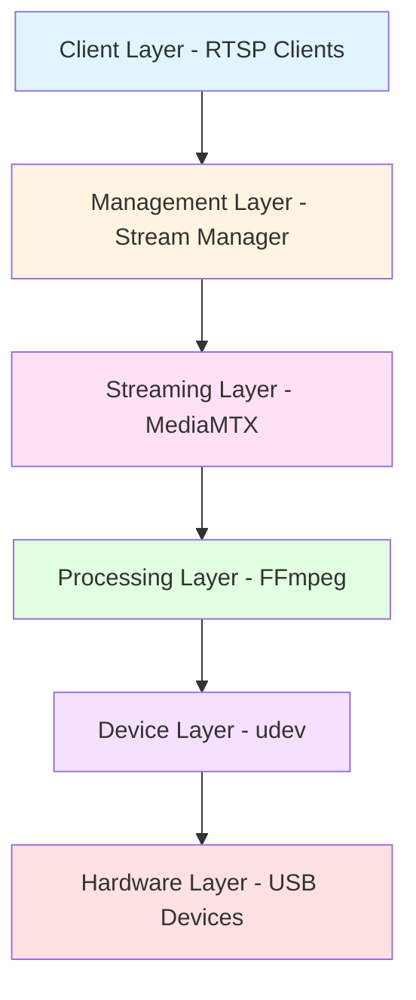
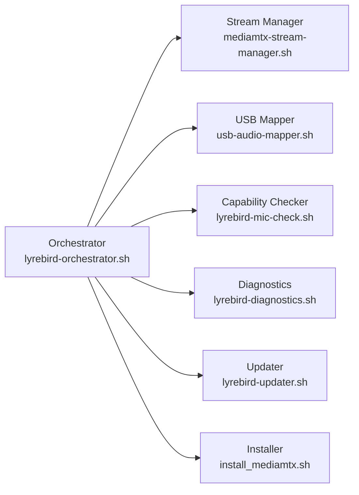
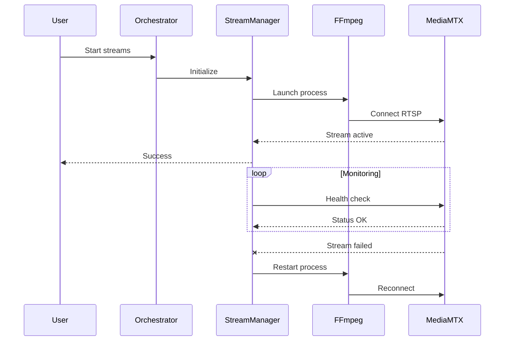
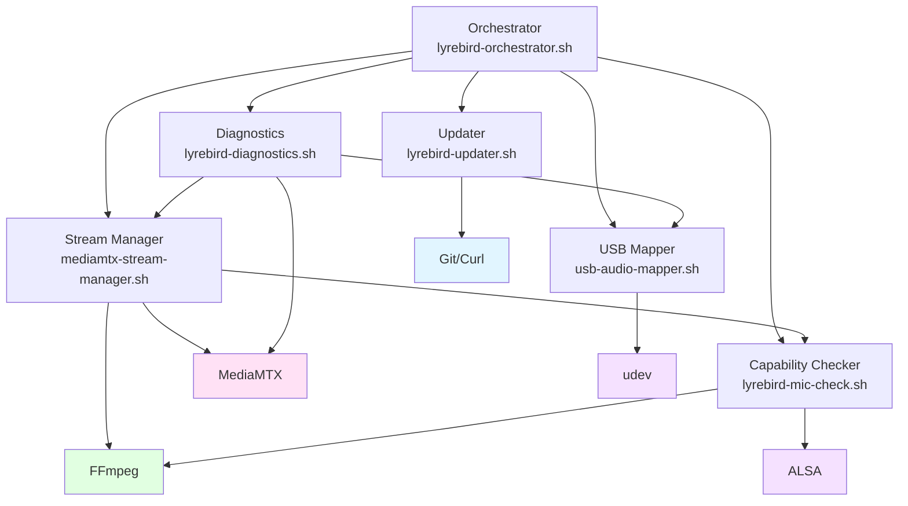

# Architecture

Comprehensive guide to LyreBirdAudio's system architecture, component design, and data flow.

---

## Overview

LyreBirdAudio implements a layered architecture that transforms USB audio devices into professional RTSP streams. The system is designed for reliability, scalability, and ease of maintenance, with clear separation of concerns across six distinct layers.

This guide covers:

- Six-layer system architecture
- Core components and their responsibilities
- Data flow from USB devices to RTSP clients
- Component interactions and dependencies
- Design principles and patterns
- Scalability considerations

---

## System Architecture

### Six-Layer Design

LyreBirdAudio's architecture follows a layered design pattern, where each layer has specific responsibilities and well-defined interfaces:

**Layer Hierarchy Diagram:** The system is organized into 6 distinct layers in a linear flow from hardware to clients. The Client Layer (RTSP Clients) connects to the Management Layer (Stream Manager), which communicates with the Streaming Layer (MediaMTX). MediaMTX interfaces with the Processing Layer (FFmpeg), which reads from the Device Layer (udev), which finally accesses the Hardware Layer (USB Devices). This top-to-bottom flow shows the chain of dependencies in the system.



**Layer Hierarchy:**

| Layer | Component | Responsibility | Key Technology |
|-------|-----------|----------------|----------------|
| 6. Client | RTSP Clients | Stream consumption | VLC, FFplay, etc. |
| 5. Management | Stream Manager | Lifecycle management | Bash scripts |
| 4. Streaming | MediaMTX | RTSP distribution | MediaMTX server |
| 3. Processing | FFmpeg | Audio encoding | FFmpeg |
| 2. Device | udev | USB persistence | udev rules |
| 1. Hardware | USB Devices | Audio capture | USB Audio Class |

### Layer 1: Hardware Layer

**Purpose:** Physical USB audio devices

**Components:**

- USB microphones
- USB audio interfaces
- USB sound cards
- USB DACs with line-in

**Characteristics:**

- USB Audio Class 2.0 compliant devices
- Supports mono and stereo capture
- Sample rates: 16kHz to 96kHz
- Bit depths: 16-bit to 24-bit

**Interface:** USB protocol (ALSA drivers)

### Layer 2: Device Layer

**Purpose:** Persistent device identification and mapping

**Components:**

- **udev Rules:** `/etc/udev/rules.d/99-usb-soundcards.rules`
- **USB Mapper:** `usb-audio-mapper.sh`
- **Capability Checker:** `lyrebird-mic-check.sh`

**Functionality:**

- Creates persistent device identifiers
- Prevents device reassignment on reconnection
- Maps USB topology to audio card numbers
- Validates device capabilities

**Key File:**

```bash
# /etc/udev/rules.d/99-usb-soundcards.rules
SUBSYSTEM=="sound", ACTION=="add", ATTRS{idVendor}=="046d", \
  ATTRS{idProduct}=="0a44", ATTR{id}="Blue_Yeti", SYMLINK+="sound/by-id/Blue_Yeti"
```

**Interface:** Device nodes in `/dev/snd/` and `/proc/asound/cards`

### Layer 3: Processing Layer

**Purpose:** Audio encoding and format conversion

**Components:**

- **FFmpeg Processes:** One per stream
- **Audio Encoders:** Opus, AAC, MP3, PCM
- **Buffer Management:** Thread queues

**Functionality:**

- Captures raw audio from ALSA devices
- Encodes to specified codec and bitrate
- Resamples to target sample rate
- Handles mono/stereo channel mapping
- Implements buffering for network transmission

**Example FFmpeg Pipeline:**

```bash
ffmpeg -f alsa -i hw:CARD=Blue_Yeti \
  -ar 48000 -ac 1 \
  -c:a libopus -b:a 128k \
  -thread_queue_size 1024 \
  -f rtsp rtsp://localhost:8554/Blue_Yeti
```

**Interface:** ALSA input -> RTSP output

### Layer 4: Streaming Layer

**Purpose:** RTSP stream distribution

**Components:**

- **MediaMTX Server:** RTSP/RTMP/HLS server
- **Configuration:** `/etc/mediamtx/mediamtx.yml`
- **API Server:** HTTP API on port 9997

**Functionality:**

- Receives RTSP streams from FFmpeg
- Manages stream paths and permissions
- Distributes to multiple clients
- Provides stream health API
- Handles client connections/disconnections

**API Endpoints:**

```bash
# List all streams
GET http://localhost:9997/v3/paths/list

# Get stream details
GET http://localhost:9997/v3/paths/get/{stream-name}
```

**Interface:** RTSP input on port 8554, client connections

### Layer 5: Management Layer

**Purpose:** Stream lifecycle and health management

**Components:**

- **Stream Manager:** `mediamtx-stream-manager.sh`
- **Orchestrator:** `lyrebird-orchestrator.sh`
- **Installer:** `install_mediamtx.sh`
- **Updater:** `lyrebird-updater.sh`

**Functionality:**

- Starts/stops/restarts streams
- Monitors stream health
- Implements automatic recovery
- Tracks resource usage
- Provides user interface

**Operations:**

```bash
# Lifecycle management
sudo ./mediamtx-stream-manager.sh start|stop|restart|status

# Monitoring
sudo ./mediamtx-stream-manager.sh monitor

# Service management
sudo systemctl enable|start|stop mediamtx-stream-manager
```

**Interface:** CLI commands, systemd integration

### Layer 6: Client Layer

**Purpose:** Stream consumption and playback

**Components:**

- Media players (VLC, FFplay)
- Recording software (OBS, Audacity)
- Streaming platforms
- Custom applications

**Supported Protocols:**

- RTSP (primary)
- RTMP (via MediaMTX)
- HLS (via MediaMTX)

**Example Clients:**

```bash
# VLC Media Player
vlc rtsp://server-ip:8554/Blue_Yeti

# FFplay
ffplay rtsp://server-ip:8554/Blue_Yeti

# FFmpeg recording
ffmpeg -i rtsp://server-ip:8554/Blue_Yeti output.opus
```

**Interface:** Network protocols (RTSP, RTMP, HLS)

---

## Core Components

### Orchestrator

**File:** `lyrebird-orchestrator.sh`

**Purpose:** Main entry point and interactive menu system

**Responsibilities:**

- Provides user-friendly menu interface
- Coordinates between components
- Validates prerequisites
- Launches appropriate scripts
- Displays system status

**Features:**

- Device detection and mapping
- Stream management
- Diagnostics and health checks
- Version management
- Configuration guidance

**Usage:**

```bash
sudo ./lyrebird-orchestrator.sh
```

**Component Interactions:**

**Component Delegation Diagram:** The Orchestrator serves as the central hub that delegates to six specialized components. From the Orchestrator, arrows point to Stream Manager, USB Mapper, Capability Checker, Diagnostics, Updater, and Installer. This hub-and-spoke pattern shows the Orchestrator's role as a coordination layer that doesn't contain business logic but delegates to appropriate specialists.



### Stream Manager

**File:** `mediamtx-stream-manager.sh`

**Purpose:** Stream lifecycle management and monitoring

**Responsibilities:**

- Launch FFmpeg processes
- Monitor stream health
- Implement automatic recovery
- Track resource usage
- Manage PID files
- Provide status reporting

**Key Functions:**

- `start_streams()` - Launch all configured streams
- `stop_streams()` - Gracefully terminate streams
- `monitor_streams()` - Continuous health monitoring
- `restart_stream()` - Exponential backoff recovery
- `get_stream_status()` - Query MediaMTX API

**Self-Healing Algorithm:**

```bash
# Pseudo-code for automatic recovery
while monitoring:
    for each stream:
        if not healthy:
            attempt = 0
            while attempt < max_attempts:
                delay = min(initial_delay * 2^attempt, max_delay)
                wait(delay)
                restart_stream()
                if healthy:
                    break
                attempt++
```

### USB Mapper

**File:** `usb-audio-mapper.sh`

**Purpose:** USB device detection and persistent mapping

**Responsibilities:**

- Detect all USB audio devices
- Map USB topology to card numbers
- Generate udev rules
- Validate device persistence
- Create symbolic links

**Detection Process:**

1. Scan `/proc/asound/cards` for all sound cards
2. Query USB attributes (vendor, product, serial)
3. Determine USB bus and port topology
4. Generate unique persistent identifiers
5. Create udev rules for each device
6. Reload udev to apply rules

**Example Output:**

```bash
$ sudo ./usb-audio-mapper.sh

Detected USB Audio Devices:
===========================
Card 0: Blue_Yeti
  Vendor: 046d
  Product: 0a44
  USB Path: 1-1.2

Card 1: USB_Microphone
  Vendor: 0d8c
  Product: 0014
  USB Path: 1-1.3

Generated udev rules: /etc/udev/rules.d/99-usb-soundcards.rules
```

### Capability Checker

**File:** `lyrebird-mic-check.sh`

**Purpose:** Device capability detection and configuration generation

**Responsibilities:**

- Test audio capture capabilities
- Determine supported formats
- Detect optimal settings
- Generate device configurations
- Validate encoding support

**Testing Process:**

1. Enumerate all audio devices
2. Test capture with FFmpeg
3. Detect supported sample rates
4. Determine channel configuration
5. Validate codec compatibility
6. Generate optimal settings

**Flags:**

- `-g` - Generate device configuration
- `--quality=low|normal|high` - Set quality preset
- `-f` - Force overwrite existing config
- `-V` - Validate existing configuration

**Quality Presets:**

| Preset | Sample Rate | Codec | Bitrate | Use Case |
|--------|-------------|-------|---------|----------|
| Low | 16 kHz | Opus | 64 kbps | Voice, minimal resources |
| Normal | 48 kHz | Opus | 128 kbps | General purpose |
| High | 48 kHz | AAC | 192 kbps | High fidelity |

### Diagnostics

**File:** `lyrebird-diagnostics.sh`

**Purpose:** System health checks and troubleshooting

**Responsibilities:**

- Run comprehensive health checks
- Validate system configuration
- Test component functionality
- Generate diagnostic reports
- Provide troubleshooting guidance

**Check Categories:**

1. **System Checks**
   - Operating system compatibility
   - Required packages installed
   - File permissions

2. **Device Checks**
   - USB audio devices detected
   - udev rules configured
   - Device persistence working

3. **Service Checks**
   - MediaMTX service running
   - Stream processes active
   - Network ports accessible

4. **Stream Checks**
   - RTSP connectivity
   - Audio data flowing
   - Codec validation

5. **Resource Checks**
   - CPU usage within limits
   - Memory available
   - File descriptors available

**Modes:**

```bash
# Quick health check
sudo ./lyrebird-diagnostics.sh

# Verbose output
sudo ./lyrebird-diagnostics.sh --verbose

# Export detailed report
sudo ./lyrebird-diagnostics.sh --export=/tmp/diagnostic-report.txt
```

### Version Manager

**File:** `lyrebird-updater.sh`

**Purpose:** Version management and update coordination

**Responsibilities:**

- Check current version
- List available updates
- Download new versions
- Backup configurations
- Apply updates safely

**Operations:**

```bash
# Check version status
sudo ./lyrebird-updater.sh --status

# List available versions
sudo ./lyrebird-updater.sh --list

# Update to latest
sudo ./lyrebird-updater.sh --update
```

### Installer

**File:** `install_mediamtx.sh`

**Purpose:** MediaMTX installation and configuration

**Responsibilities:**

- Download MediaMTX binary
- Install to correct location
- Configure systemd service
- Set up initial configuration
- Validate installation

**Installation Process:**

1. Detect system architecture
2. Download appropriate MediaMTX binary
3. Install to `/usr/local/bin/`
4. Create configuration directory
5. Generate default configuration
6. Set up systemd service
7. Enable and start service

---

## Data Flow

### End-to-End Stream Pipeline

**Data Flow Pipeline:** Audio data flows through six stages in a left-to-right pipeline. Starting from the USB Microphone, audio samples flow to the ALSA Driver, which provides a hw:CARD interface to FFmpeg Capture. The raw audio goes through the FFmpeg Encoder, producing an encoded stream that flows to MediaMTX. Finally, MediaMTX distributes via RTSP protocol to Network Clients. This shows the complete journey of audio data from hardware capture to network distribution.


### Detailed Data Flow

**Stage 1: Audio Capture**

```
USB Device -> USB Controller -> ALSA Driver -> Application Buffer
```

- USB device captures analog audio
- Converts to digital samples (16-24 bit)
- Transmits via USB protocol
- ALSA driver receives and buffers

**Stage 2: FFmpeg Processing**

```
ALSA Buffer -> FFmpeg Input -> Resampler -> Encoder -> RTSP Muxer
```

- FFmpeg reads from ALSA device
- Resamples to target rate if needed
- Encodes with selected codec
- Packetizes for RTSP transport

**Stage 3: MediaMTX Distribution**

```
RTSP Stream -> MediaMTX Receiver -> Stream Buffer -> Client Connections
```

- MediaMTX receives RTSP stream
- Buffers for multiple clients
- Distributes to connected clients
- Manages connection state

**Stage 4: Client Playback**

```
RTSP Packets -> Network -> Client Decoder -> Audio Output
```

- Client receives RTSP packets
- Decodes audio stream
- Buffers for smooth playback
- Sends to audio output device

### Control Flow

**Stream Lifecycle Sequence:** This sequence diagram shows the interactions between User, Orchestrator, StreamManager, FFmpeg, and MediaMTX during stream startup and monitoring. The flow begins with the User sending a "Start streams" command to the Orchestrator, which initializes the StreamManager. The StreamManager launches FFmpeg processes that connect to MediaMTX via RTSP. MediaMTX confirms the stream is active back to the StreamManager, which reports success to the User. A monitoring loop then shows the StreamManager continuously checking MediaMTX health status. If a stream failure is detected, the StreamManager automatically restarts the FFmpeg process and reconnects to MediaMTX.



---

## Design Principles

### Separation of Concerns

Each component has a single, well-defined responsibility:

- **USB Mapper:** Device detection only
- **Capability Checker:** Configuration generation only
- **Stream Manager:** Lifecycle management only
- **MediaMTX:** Stream distribution only

**Benefits:**

- Easy to understand and maintain
- Simple to test individual components
- Clear interfaces between layers
- Reduced coupling

### Fail-Fast and Self-Healing

The system detects failures early and recovers automatically:

**Fail-Fast:**

- Validate configuration before starting
- Check prerequisites during initialization
- Return clear error codes
- Log detailed error information

**Self-Healing:**

- Monitor stream health continuously
- Detect failures immediately
- Implement exponential backoff recovery
- Clean up resources before restart
- Validate recovery success

### Idempotency

Operations can be safely repeated without side effects:

```bash
# Safe to run multiple times
sudo ./usb-audio-mapper.sh
sudo ./mediamtx-stream-manager.sh start
sudo ./lyrebird-diagnostics.sh
```

**Implementation:**

- Check current state before acting
- Skip unnecessary operations
- Clean up previous state
- Generate consistent output

### Configuration as Code

All configuration is stored in version-controllable files:

- Device mappings: `/etc/udev/rules.d/99-usb-soundcards.rules`
- Stream settings: `/etc/mediamtx/audio-devices.conf`
- Server config: `/etc/mediamtx/mediamtx.yml`

**Benefits:**

- Reproducible deployments
- Easy backup and restore
- Change tracking with git
- Automated provisioning

---

## Scalability

### Vertical Scaling

**Single-Server Limits:**

| Platform | Max Devices | CPU | Memory |
|----------|-------------|-----|--------|
| Raspberry Pi 4 | 2 | 4-core ARM | 4-8 GB |
| Intel N100 | 8-10 | 4-core x86 | 8-16 GB |
| Workstation | 20+ | Multi-core | 32+ GB |

**Resource Calculation:**

```
CPU per stream: 1-5%
Memory per stream: 40-80 MB
Total CPU = Num_Streams × 3% (average)
Total Memory = (Num_Streams × 50 MB) + 200 MB base
```

**Example:**

```
10 streams:
  CPU: 10 × 3% = 30% total
  Memory: (10 × 50 MB) + 200 MB = 700 MB
```

### Horizontal Scaling

For larger deployments, distribute across multiple servers:

**Deployment Pattern:**

```
Server 1: Devices 1-10  -> streams.example.com
Server 2: Devices 11-20 -> streams2.example.com
Server 3: Devices 21-30 -> streams3.example.com
```

**Load Balancing:**

- Geographic distribution
- Device type grouping
- Resource-based assignment
- Failover configuration

### Performance Optimization

**Codec Selection:**

| Codec | CPU Usage | Quality | Bandwidth |
|-------|-----------|---------|-----------|
| Opus | Low | Excellent | Low |
| AAC | Medium | Excellent | Medium |
| MP3 | Medium | Good | Medium |
| PCM | Minimal | Perfect | Very High |

**Recommendations:**

- Use Opus for best efficiency
- Lower sample rate for voice (16kHz)
- Use mono for single microphones
- Adjust bitrate based on quality needs

---

## Component Dependencies

### Dependency Graph

**Component Dependencies:** This diagram shows how LyreBirdAudio components depend on each other and external systems. The Orchestrator depends on Stream Manager, USB Mapper, Capability Checker, Diagnostics, and Updater. Stream Manager depends on MediaMTX, FFmpeg, and Capability Checker. USB Mapper depends on udev. Capability Checker depends on FFmpeg and ALSA. Diagnostics depends on MediaMTX, Stream Manager, and USB Mapper. Updater depends on Git/Curl. The external dependencies (MediaMTX, FFmpeg, udev, ALSA, Git/Curl) are highlighted in different colors to distinguish them from internal components.



### External Dependencies

**Required Packages:**

```bash
# Core dependencies
ffmpeg >= 4.4
alsa-utils
curl
jq

# Optional dependencies
vlc            # For testing streams
systemd        # For service management
git            # For updates
```

**Validation:**

```bash
# Check dependencies
sudo ./lyrebird-diagnostics.sh --check-deps
```

---

## Best Practices

### Component Design

1. **Single Responsibility** - Each component does one thing well
2. **Clear Interfaces** - Well-defined input/output contracts
3. **Error Handling** - Comprehensive error checking and reporting
4. **Logging** - Detailed logs for troubleshooting
5. **Documentation** - Clear usage instructions

### System Integration

1. **Use Systemd** - Manage services with systemd
2. **Version Control** - Track configuration changes
3. **Monitor Health** - Implement continuous monitoring
4. **Backup Regularly** - Backup configurations and scripts
5. **Test Thoroughly** - Validate before production deployment

### Performance

1. **Match Hardware** - Don't exceed platform capabilities
2. **Optimize Settings** - Use appropriate quality for use case
3. **Monitor Resources** - Track CPU, memory, file descriptors
4. **Plan Capacity** - Calculate requirements before deployment
5. **Scale Horizontally** - Distribute load across servers

---

## Related Documentation

- [Performance Tuning](performance.md) - Optimization strategies
- [Troubleshooting](troubleshooting.md) - Common issues and solutions
- [Custom Integration](custom-integration.md) - Extending the system
- [Stream Management](../user-guide/stream-management.md) - Operational guide
- [System Overview](../about/system-overview.md) - High-level overview

---

## Next Steps

<div class="grid" markdown>

<div markdown>
### Performance Tuning
Optimization strategies and best practices

[Performance Tuning →](performance.md)
</div>

<div markdown>
### Troubleshooting
Common issues and solutions

[Troubleshooting →](troubleshooting.md)
</div>

</div>
