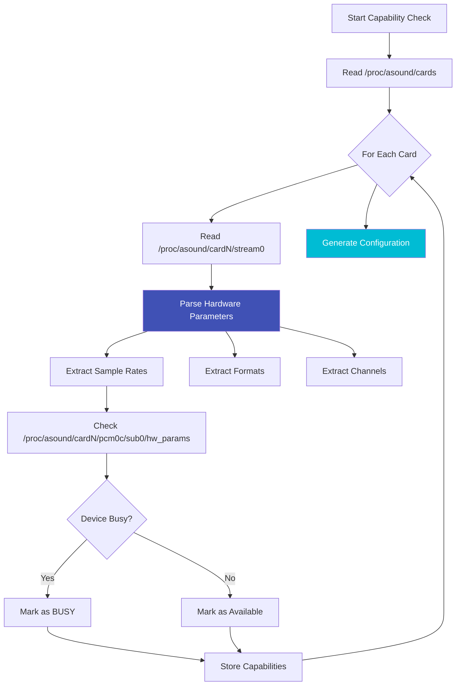

# Capability Checker

**Script:** `lyrebird-mic-check.sh`
**Version:** 1.0.0
**Purpose:** Detect hardware capabilities and generate configuration

---

## Overview

The Capability Checker is a sophisticated hardware detection tool that automatically discovers what your USB audio devices are capable of, then generates optimal configuration files. It uses non-invasive detection methods to avoid interrupting active streams, making it safe to run even in production environments.

!!! tip "No Configuration Guesswork"
    The Capability Checker eliminates configuration guesswork by directly querying hardware capabilities. You get configurations that are guaranteed to work with your specific devices.

---

## Key Features

<div class="grid" markdown>

<div markdown>
### :material-magnify: Non-Invasive Detection
Uses `/proc/asound` filesystem to detect capabilities without opening hardware devices.
</div>

<div markdown>
### :material-shield-check: Device Busy Detection
Checks if devices are in use without interrupting active streams.
</div>

<div markdown>
### :material-file-cog: Auto-Configuration
Generates complete configuration files with optimal settings for your hardware.
</div>

<div markdown>
### :material-backup-restore: Automatic Backup
Backs up existing configurations before making changes, with easy restore capability.
</div>

<div markdown>
### :material-code-json: JSON Output
Provides machine-readable output for integration with other tools.
</div>

<div markdown>
### :material-alert: USB Adapter Warnings
Detects USB audio adapters and warns about chip vs. microphone capabilities.
</div>

</div>

---

## Usage

### List All Audio Devices

Display all detected audio devices with their capabilities:

```bash
./lyrebird-mic-check.sh
```

**Example Output:**
```
━━━━━━━━━━━━━━━━━━━━━━━━━━━━━━━━━━━━━━━━━━━━━━━━━━━
LyreBird Audio Device Capability Checker v1.0.0
━━━━━━━━━━━━━━━━━━━━━━━━━━━━━━━━━━━━━━━━━━━━━━━━━━━

Device 0: USB Microphone
═══════════════════════════════════════════════════
  Card: 0
  Device Path: /dev/snd/pcmC0D0c
  Persistent Path: /dev/snd/by-usb-port/front-yard-mic

  Capabilities:
    Sample Rates: 16000, 44100, 48000 Hz
    Channels: 1 (mono), 2 (stereo)
    Formats: S16_LE, S24_3LE
    Bit Depths: 16-bit, 24-bit

  USB Info:
    Vendor: 0x046d (Logitech)
    Product: 0x0825
    Bus-Port: 1-1.4

  Status: Available (not busy)

Device 1: USB Audio Interface
═══════════════════════════════════════════════════
  Card: 1
  Device Path: /dev/snd/pcmC1D0c
  Persistent Path: /dev/snd/by-usb-port/studio-interface

  Capabilities:
    Sample Rates: 44100, 48000, 96000 Hz
    Channels: 2 (stereo)
    Formats: S16_LE, S24_LE, S32_LE
    Bit Depths: 16-bit, 24-bit, 32-bit

  USB Info:
    Vendor: 0x0d8c (C-Media Electronics)
    Product: 0x0014
    Bus-Port: 1-1.5

  ⚠️  WARNING: This appears to be a USB audio adapter chip.
      If using 3.5mm analog input, detected capabilities
      reflect the chip, not your connected microphone.

  Status: BUSY (currently in use)
```

---

### Show Specific Device

Get detailed information about a single device by card number:

```bash
./lyrebird-mic-check.sh 0
```

Shows comprehensive capability information for card 0 only.

---

### Generate Configuration

Create optimized configuration files based on detected hardware:

```bash
# Generate with normal quality (default)
sudo ./lyrebird-mic-check.sh -g

# High quality (music/high-fidelity recording)
sudo ./lyrebird-mic-check.sh -g --quality=high

# Low quality (speech/monitoring, bandwidth-constrained)
sudo ./lyrebird-mic-check.sh -g --quality=low
```

**Generated File:** `/etc/mediamtx/audio-devices.conf`

---

### Validate Configuration

Verify existing configuration against hardware capabilities:

```bash
sudo ./lyrebird-mic-check.sh -V
```

**Validation Checks:**
- Sample rates are supported by hardware
- Channel counts match device capabilities
- Formats are available on the device
- Configuration syntax is valid

**Example Output:**
```
Validating /etc/mediamtx/audio-devices.conf...

✓ DEVICE_FRONT_YARD_MIC_SAMPLE_RATE=48000
  Hardware supports: 16000, 44100, 48000 Hz

✓ DEVICE_FRONT_YARD_MIC_CHANNELS=2
  Hardware supports: 1 (mono), 2 (stereo)

✗ DEVICE_STUDIO_INTERFACE_SAMPLE_RATE=192000
  ERROR: Hardware only supports up to 96000 Hz
  Supported: 44100, 48000, 96000 Hz

Validation: 2 passed, 1 failed
```

---

### JSON Output

Get machine-readable output for scripting and automation:

```bash
./lyrebird-mic-check.sh --format=json
```

**Output Format:**
```json
{
  "devices": [
    {
      "card": 0,
      "name": "USB Microphone",
      "device_path": "/dev/snd/pcmC0D0c",
      "persistent_path": "/dev/snd/by-usb-port/front-yard-mic",
      "capabilities": {
        "sample_rates": [16000, 44100, 48000],
        "channels": [1, 2],
        "formats": ["S16_LE", "S24_3LE"],
        "bit_depths": [16, 24]
      },
      "usb": {
        "vendor_id": "046d",
        "product_id": "0825",
        "bus_port": "1-1.4"
      },
      "busy": false
    }
  ]
}
```

---

### Restore from Backup

Revert to previous configuration:

```bash
sudo ./lyrebird-mic-check.sh --restore
```

Restores the most recent automatic backup of `/etc/mediamtx/audio-devices.conf`.

**Backup Location:** `/etc/mediamtx/audio-devices.conf.backup.YYYYMMDD_HHMMSS`

---

## Quality Tiers

The Capability Checker supports three quality presets:

### Low Quality (Speech/Monitoring)

**Usage:**
```bash
sudo ./lyrebird-mic-check.sh -g --quality=low
```

**Settings:**
- **Sample Rate:** 16000 Hz
- **Bitrate:** 64 kbps
- **Codec:** Opus
- **Channels:** As detected (typically mono)

**Best For:**
- Speech monitoring
- Bandwidth-constrained networks
- Long-term storage (smaller files)
- Raspberry Pi deployments (lower CPU)

**File Size:** ~28 MB/hour (mono)

---

### Normal Quality (Default, Balanced)

**Usage:**
```bash
sudo ./lyrebird-mic-check.sh -g --quality=normal
# or simply:
sudo ./lyrebird-mic-check.sh -g
```

**Settings:**
- **Sample Rate:** 48000 Hz
- **Bitrate:** 128 kbps
- **Codec:** Opus
- **Channels:** As detected

**Best For:**
- General-purpose bird song recording
- Balanced quality/bandwidth trade-off
- Most USB microphones
- 24/7 continuous monitoring

**File Size:** ~56 MB/hour (stereo)

---

### High Quality (Music/High-Fidelity)

**Usage:**
```bash
sudo ./lyrebird-mic-check.sh -g --quality=high
```

**Settings:**
- **Sample Rate:** 48000 Hz or higher (96000 Hz if supported)
- **Bitrate:** 256 kbps
- **Codec:** Opus or AAC
- **Channels:** As detected (prefer stereo)

**Best For:**
- Music recording
- Professional audio monitoring
- High-fidelity bird vocalizations
- Post-processing and analysis

**File Size:** ~112 MB/hour (stereo)

---

## How It Works

### Non-Invasive Detection

The Capability Checker uses the ALSA proc filesystem for detection, which doesn't require opening devices:



### Technical Approach

**1. Card Enumeration:**
```bash
# Read /proc/asound/cards
cat /proc/asound/cards
```

**2. Capability Detection:**
```bash
# For each card, read stream parameters
cat /proc/asound/card0/stream0

# Example output:
# USB Microphone at usb-0000:00:14.0-4, full speed : USB Audio
#
# Playback:
#   Status: Stop
#   Interface 0
#     Altset 1
#     Format: S16_LE
#     Channels: 2
#     Endpoint: 0x01 (1 OUT) (ASYNC)
#     Rates: 48000
```

**3. Busy State Detection:**
```bash
# Check if device is currently in use
cat /proc/asound/card0/pcm0c/sub0/hw_params

# If file exists and contains parameters → Device is busy
# If file is empty or doesn't exist → Device is available
```

**4. USB Device Information:**
```bash
# Follow symlink to get USB bus/port info
readlink -f /sys/class/sound/card0/device

# Example: /sys/devices/pci0000:00/0000:00:14.0/usb1/1-4/1-4:1.0
# Extracts: Bus 1, Port 4
```

### Bit Depth Derivation

ALSA format specifications encode bit depth:

| ALSA Format | Bit Depth | Endianness |
|-------------|-----------|------------|
| `S16_LE` | 16-bit | Little Endian |
| `S24_LE` | 24-bit | Little Endian |
| `S24_3LE` | 24-bit (3-byte) | Little Endian |
| `S32_LE` | 32-bit | Little Endian |
| `U8` | 8-bit | Unsigned |

The Capability Checker parses these formats to determine supported bit depths.

---

## USB Audio Adapter Detection

### The Challenge

USB audio adapters with 3.5mm analog inputs have **two** sets of capabilities:

1. **USB Chip Capabilities**: What the USB controller supports (detected by this tool)
2. **Microphone Capabilities**: What your analog microphone can actually deliver

**Example Scenario:**
```
USB Audio Adapter Chip:
  ✓ Supports 96kHz sample rate
  ✓ Supports 24-bit depth
  ✓ Supports stereo channels

Your Connected Microphone:
  ✗ Actually only mono
  ✗ Quality peaks at 48kHz
  ✗ Effective depth is 16-bit
```

### Warning System

The Capability Checker detects USB audio adapters and issues warnings:

```
⚠️  WARNING: This appears to be a USB audio adapter chip.

If you're using a 3.5mm analog input (microphone or line-in):
  • Detected capabilities reflect the USB chip, NOT your microphone
  • Always verify your microphone is physically connected
  • Check correct input type selected (mic vs. line level)
  • Verify channel configuration (mono mic on stereo jack?)
  • Test recorded audio quality after configuration

For USB microphones (native USB), ignore this warning.
```

### Best Practices with USB Adapters

!!! warning "Verify Physical Configuration"
    For USB audio adapters with 3.5mm inputs:

    1. **Physically inspect** the microphone connection
    2. **Test record** a short sample and verify audio quality
    3. **Use conservative settings** (48kHz, 16-bit) initially
    4. **Monitor actual audio quality** rather than relying solely on detected capabilities

---

## Configuration Generation

### Generated File Format

**Location:** `/etc/mediamtx/audio-devices.conf`

**Format:**
```bash
# Auto-generated by lyrebird-mic-check.sh
# Quality tier: normal
# Generation date: 2025-11-15 14:30:00

# Device: USB Microphone (Card 0)
# Persistent path: /dev/snd/by-usb-port/front-yard-mic
DEVICE_FRONT_YARD_MIC_SAMPLE_RATE=48000
DEVICE_FRONT_YARD_MIC_CHANNELS=2
DEVICE_FRONT_YARD_MIC_BITRATE=128k
DEVICE_FRONT_YARD_MIC_CODEC=opus
DEVICE_FRONT_YARD_MIC_THREAD_QUEUE=8192

# Device: USB Audio Interface (Card 1)
# Persistent path: /dev/snd/by-usb-port/studio-interface
DEVICE_STUDIO_INTERFACE_SAMPLE_RATE=48000
DEVICE_STUDIO_INTERFACE_CHANNELS=2
DEVICE_STUDIO_INTERFACE_BITRATE=128k
DEVICE_STUDIO_INTERFACE_CODEC=opus
DEVICE_STUDIO_INTERFACE_THREAD_QUEUE=8192

# Fallback defaults (for devices without specific config)
DEFAULT_SAMPLE_RATE=48000
DEFAULT_CHANNELS=2
DEFAULT_BITRATE=128k
DEFAULT_CODEC=opus
DEFAULT_THREAD_QUEUE=8192
```

### Dual-Lookup System

The configuration system supports both friendly names and full device IDs:

**Friendly Name:**
```bash
DEVICE_FRONT_YARD_MIC_SAMPLE_RATE=48000
```

**Full Device ID (if friendly name unavailable):**
```bash
DEVICE_USB_MICROPHONE_046D_0825_ABC123_SAMPLE_RATE=48000
```

The Stream Manager tries friendly names first, then falls back to full IDs, ensuring compatibility.

---

## Automatic Backup

### Backup Creation

Every time you generate a new configuration, the previous one is automatically backed up:

**Backup Location:** `/etc/mediamtx/audio-devices.conf.backup.YYYYMMDD_HHMMSS`

**Example:**
```
/etc/mediamtx/audio-devices.conf.backup.20251115_143000
```

### Restore Process

```bash
# List available backups
ls -ltr /etc/mediamtx/audio-devices.conf.backup.*

# Restore most recent backup
sudo ./lyrebird-mic-check.sh --restore

# Manual restore (specific backup)
sudo cp /etc/mediamtx/audio-devices.conf.backup.20251115_143000 \
         /etc/mediamtx/audio-devices.conf
```

**Note:** Backups are retained indefinitely. You may want to manually clean up old backups periodically to save disk space.

---

## Integration with Other Components

### With USB Audio Mapper

The Capability Checker automatically detects persistent device paths:

```bash
# 1. Map devices to persistent names
sudo ./usb-audio-mapper.sh
sudo reboot

# 2. Generate config (uses persistent names)
sudo ./lyrebird-mic-check.sh -g
```

**Result:**
```bash
DEVICE_FRONT_YARD_MIC_SAMPLE_RATE=48000  # Uses friendly name!
```

### With Stream Manager

The Stream Manager reads the generated configuration:

```bash
# 1. Generate configuration
sudo ./lyrebird-mic-check.sh -g

# 2. Start streams (uses auto-detected settings)
sudo ./mediamtx-stream-manager.sh start
```

No manual configuration editing required!

### With Orchestrator

The Orchestrator integrates capability checking into setup workflows:

**Quick Setup Wizard:**
1. Install MediaMTX
2. Run USB Audio Mapper
3. **Run Capability Checker** ← Auto-generates config
4. Start streams
5. Install systemd service

---

## Command Line Options

### Complete Reference

| Option | Short | Description |
|--------|-------|-------------|
| (no args) | | List all devices with capabilities |
| `<card_number>` | | Show details for specific card |
| `--generate` | `-g` | Generate configuration file |
| `--quality=<tier>` | | Set quality tier (low/normal/high) |
| `--validate` | `-V` | Validate existing configuration |
| `--json` | | Output in JSON format |
| `--restore` | | Restore from most recent backup |
| `--help` | `-h` | Show help message |

---

## Troubleshooting

### No Devices Detected

**Symptoms:** "No audio devices found"

**Solutions:**
```bash
# Check if devices are connected
lsusb | grep -i audio

# Verify ALSA sees the devices
arecord -l

# Check if /proc/asound exists
ls -la /proc/asound/

# Reload ALSA
sudo alsa force-reload
```

---

### Wrong Capabilities Detected

**Symptoms:** Detected capabilities don't match expectations

**Possible Causes:**
1. **USB Audio Adapter**: Chip capabilities vs. microphone capabilities
2. **Driver Limitations**: ALSA driver may not expose all hardware features
3. **Firmware Issues**: Device firmware may report incorrect capabilities

**Solutions:**
```bash
# For USB adapters, test with conservative settings
DEVICE_XXX_SAMPLE_RATE=48000
DEVICE_XXX_CHANNELS=1
DEVICE_XXX_BITRATE=128k

# Test recording to verify
arecord -D hw:CARD=device-name -f S16_LE -r 48000 -c 1 -d 5 test.wav
aplay test.wav
```

---

### Configuration Validation Fails

**Symptoms:** `lyrebird-mic-check.sh -V` reports errors

**Solutions:**
```bash
# View the validation errors
sudo ./lyrebird-mic-check.sh -V

# Common fixes:
# 1. Sample rate not supported → Use detected rate
# 2. Channel count mismatch → Check mono vs. stereo
# 3. Format unavailable → Use S16_LE (universally supported)

# Regenerate with conservative settings
sudo ./lyrebird-mic-check.sh -g --quality=normal
```

---

### Permission Errors

**Symptoms:** "Permission denied" when generating config

**Solutions:**
```bash
# Must run with sudo for config generation
sudo ./lyrebird-mic-check.sh -g

# For listing devices, sudo is optional
./lyrebird-mic-check.sh

# Check /etc/mediamtx directory permissions
ls -ld /etc/mediamtx
sudo mkdir -p /etc/mediamtx
sudo chmod 755 /etc/mediamtx
```

---

## Best Practices

!!! tip "Run After Device Changes"
    Regenerate configuration whenever you add, remove, or replace USB audio devices.

!!! tip "Validate After Manual Edits"
    If you manually edit `/etc/mediamtx/audio-devices.conf`, always validate: `sudo ./lyrebird-mic-check.sh -V`

!!! tip "Start with Normal Quality"
    Use normal quality tier for initial setup, then optimize based on actual requirements.

!!! warning "Test USB Adapters Thoroughly"
    For USB audio adapters with 3.5mm inputs, always test record sample audio to verify configuration.

!!! warning "Backup Before Regenerating"
    Although automatic backups are created, consider manual backup for critical configurations before regenerating.

---

## Advanced Usage

### Scripted Automation

```bash
#!/bin/bash
# automated-config-gen.sh

# Generate configuration for all detected devices
sudo ./lyrebird-mic-check.sh -g --quality=normal

# Validate the generated configuration
if sudo ./lyrebird-mic-check.sh -V; then
    echo "Configuration valid, restarting streams..."
    sudo ./mediamtx-stream-manager.sh restart
else
    echo "Configuration validation failed!"
    sudo ./lyrebird-mic-check.sh --restore
    exit 1
fi
```

### JSON Processing

```bash
# Extract sample rates for all devices
./lyrebird-mic-check.sh --json | jq '.devices[].capabilities.sample_rates'

# Get list of busy devices
./lyrebird-mic-check.sh --json | jq '.devices[] | select(.busy==true) | .name'

# Generate report
./lyrebird-mic-check.sh --json | jq -r '
  .devices[] |
  "Device: \(.name)\nPath: \(.persistent_path)\nRates: \(.capabilities.sample_rates | join(", "))\n"
'
```

---

## Related Documentation

- **[USB Audio Mapper](usb-audio-mapper.md)** - Create persistent device names
- **[Stream Manager](stream-manager.md)** - Uses generated configuration
- **[Orchestrator](orchestrator.md)** - Integrates capability checking
- **[User Guide: Configuration](../user-guide/configuration.md)** - Configuration guide
- **[Reference: Configuration Files](../reference/configuration-files.md)** - Config reference

---

## See Also

- [Getting Started: Installation](../getting-started/installation.md)
- [Getting Started: Basic Usage](../getting-started/basic-usage.md)
- [Advanced: Troubleshooting](../advanced/troubleshooting.md)
- [ALSA Project Documentation](https://www.alsa-project.org/wiki/Main_Page)
