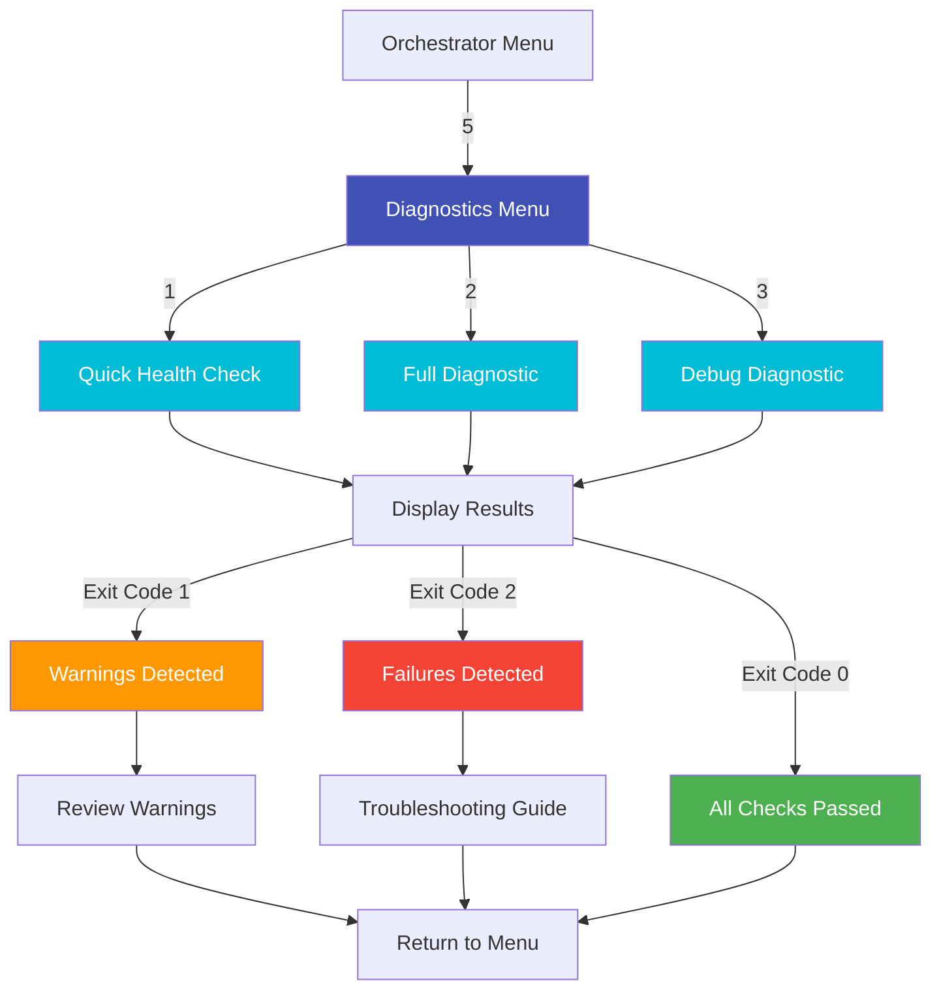

# Diagnostics

**Script:** `lyrebird-diagnostics.sh`
**Version:** 1.0.2
**Purpose:** Comprehensive system health checks and validation

---

## Overview

The Diagnostics component provides comprehensive system health validation for LyreBirdAudio deployments. It performs 20+ automated checks across system resources, USB devices, MediaMTX service, stream health, RTSP connectivity, and log analysis to identify issues before they impact operations.

!!! tip "Proactive Monitoring"
    Regular diagnostic checks catch problems early. Run quick checks daily and full diagnostics weekly to maintain system health.

---

## Key Features

<div class="grid" markdown>

<div markdown>
### 20+ Health Checks
Automated validation of system resources, USB devices, MediaMTX service, streams, RTSP connectivity, logs, and time synchronization.
</div>

<div markdown>
### Three Diagnostic Modes
Quick (essential checks), Full (comprehensive analysis), and Debug (maximum verbosity) modes for different use cases.
</div>

<div markdown>
### Actionable Error Reporting
Clear identification of failures with specific remediation steps and guidance for GitHub issue submission.
</div>

<div markdown>
### Resource Constraint Detection
Monitors CPU, memory, file descriptors, and disk space to identify performance bottlenecks before they cause failures.
</div>

<div markdown>
### Process Stability Analysis
Validates FFmpeg process counts, detects process accumulation, and identifies stream health issues.
</div>

<div markdown>
### Audio Subsystem Conflict Detection
Detects device conflicts, ALSA state issues, and USB device problems that prevent stream startup.
</div>

</div>

---

## Usage

### Basic Commands

```bash
# Quick check (essential systems only)
sudo ./lyrebird-diagnostics.sh quick

# Full diagnostics (comprehensive analysis)
sudo ./lyrebird-diagnostics.sh full

# Debug mode (maximum verbosity)
sudo ./lyrebird-diagnostics.sh debug
```

### Advanced Options

```bash
# Specify alternate MediaMTX config
sudo ./lyrebird-diagnostics.sh --config /path/to/mediamtx.yml full

# Set command timeout (default: 30 seconds)
sudo ./lyrebird-diagnostics.sh --timeout 60 full

# Enable verbose debug output
sudo ./lyrebird-diagnostics.sh --debug full

# Suppress non-error output
sudo ./lyrebird-diagnostics.sh --quiet quick

# Disable color output (for logs)
sudo ./lyrebird-diagnostics.sh --no-color full
```

### Integration with Orchestrator

The Diagnostics component is accessible through the Orchestrator menu:

```bash
sudo ./lyrebird-orchestrator.sh
# Main Menu -> 5 (Diagnostics & Information)
# Then choose: 1 (Quick), 2 (Full), or 3 (Debug)
```

---

## Diagnostic Modes

### Quick Mode (Essential Checks)

**Purpose:** Fast verification of critical systems

**Usage:**
```bash
sudo ./lyrebird-diagnostics.sh quick
```

**Checks Performed:**
- Prerequisites: bash version, standard utilities (grep, sed, awk, ps, sort, uniq, cut, date, mkdir, rm, chmod)
- Optional tools: timeout, lsof, alsamixer, ffmpeg (NOT arecord or jq)
- Project info: script versions, configured devices
- Project files: file permissions, git status
- Log locations: verify log files exist and are accessible (NOT content analysis)
- USB audio device detection
- MediaMTX service status
- RTSP connectivity testing

**Note:** Quick mode does NOT analyze log content or check active stream count - use Full mode for those.

**Use Cases:**
- Daily health verification
- Pre-deployment validation
- Quick troubleshooting
- Before major operations

**Typical Duration:** 10-15 seconds

---

### Full Mode (Comprehensive Analysis)

**Purpose:** Complete system health analysis

**Usage:**
```bash
sudo ./lyrebird-diagnostics.sh full
```

**Checks Performed:**
- All Quick mode checks
- System information (OS, kernel, uptime)
- Detailed USB device validation
- MediaMTX configuration validation
- FFmpeg process analysis
- RTSP connectivity testing
- Log analysis (error patterns)
- Resource utilization (CPU, memory, file descriptors)
- Disk space availability
- Time synchronization status

**Use Cases:**
- Weekly maintenance checks
- Troubleshooting complex issues
- Post-installation validation
- Before critical deployments

**Typical Duration:** 30-60 seconds

---

### Debug Mode (Maximum Verbosity)

**Purpose:** Detailed failure analysis for troubleshooting

**Usage:**
```bash
sudo ./lyrebird-diagnostics.sh debug
```

**Checks Performed:**
Debug mode is NOT "Full mode with verbose output". It runs a different set of checks:

**Includes (same as Full):**
- Prerequisites and project info
- System information
- USB devices
- MediaMTX service and configuration
- Stream health and resource constraints
- Process stability and audio conflicts
- Network resources and time/clock health
- Service dependencies

**Different from Full:**
- INCLUDES: Log content analysis (analyzes errors/warnings in logs)
- EXCLUDES: Project file validation (permissions, git status)
- EXCLUDES: Log location checks (file accessibility)

**Use Cases:**
- Troubleshooting persistent failures
- GitHub issue preparation
- Developer debugging
- Root cause analysis

**Typical Duration:** 60-120 seconds

!!! warning "Performance Impact"
    Debug mode performs extensive checks and logging. Avoid running continuously in production environments.

---

## Check Categories

### System Health

**What Gets Checked:**
- Operating system type and version
- Kernel version
- System uptime
- System load (1, 5, 15 minute averages)
- CPU utilization
- Memory availability (total, used, free, buffers, cache)
- Required utilities presence (ffmpeg, arecord, jq, curl)

**Example Output:**
```
[PASS] OS: Ubuntu 22.04.3 LTS
[PASS] Kernel: 5.15.0-91-generic
[PASS] Uptime: 15 days, 7 hours
[PASS] Load: 1.23 1.45 1.67 (healthy)
[PASS] Memory: 3.2G / 8.0G used (40%)
[PASS] All required utilities installed
```

---

### USB Audio Devices

**What Gets Checked:**
- USB audio device detection via `lsusb`
- ALSA card enumeration via `arecord -l`
- Device mapping status (udev rules)
- USB port path validation
- Device busy state (hw_params check)
- Device symlinks (`/dev/sound/by-id/`)

**Example Output:**
```
[PASS] Found 3 USB audio devices
[PASS] ALSA cards: Card 0, Card 1, Card 2
[PASS] udev rules: /etc/udev/rules.d/99-usb-soundcards.rules
[PASS] Device mappings: Device_1, Device_2, Device_3
[PASS] All devices available (not busy)
```

**Detected Issues:**
- No USB devices found
- ALSA card mismatch
- Missing udev rules
- Device enumeration order changes
- Devices in use by other processes

---

### MediaMTX Service

**What Gets Checked:**
- MediaMTX binary installation (`/usr/local/bin/mediamtx`)
- Configuration file validity (`/etc/mediamtx/mediamtx.yml`)
- Service status (systemd or standalone)
- RTSP port availability (port 8554)

**Note:** MediaMTX version is checked in the `check_project_info` section, not here. API port 9997 is NOT checked.

**Example Output:**
```
  [PASS] MediaMTX binary: /usr/local/bin/mediamtx
  [PASS] Config file: /etc/mediamtx/mediamtx.yml (valid)
  [PASS] Service: active (running)
  [PASS] RTSP port: 8554 (listening)
```

**Detected Issues:**
- MediaMTX not installed
- Binary not executable
- Invalid configuration file
- Service not running
- API not accessible
- Port conflicts

---

### Stream Status

**What Gets Checked:**
- Active stream count via MediaMTX API
- FFmpeg process validation
- Process-to-stream correlation
- Stream health and uptime
- Resource usage per stream
- Process accumulation detection

**Example Output:**
```
[PASS] Active streams: 3
[PASS] FFmpeg processes: 3 (healthy)
[PASS] All streams publishing
[PASS] Stream uptime: 2h 15m average
[PASS] No process accumulation detected
```

**Detected Issues:**
- Stream count mismatch
- FFmpeg process accumulation
- Unhealthy streams
- Streams not publishing
- High resource usage per stream

---

### RTSP Connectivity

**What Gets Checked:**
- RTSP port 8554 accessibility
- RTSP protocol validation
- Stream connection testing
- Client connection simulation

**Example Output:**
```
[PASS] Port 8554: LISTENING
[PASS] RTSP protocol: responding
[PASS] Stream test: rtsp://localhost:8554/Device_1 (OK)
```

**Detected Issues:**
- Port not accessible
- RTSP not responding
- Stream connection failures
- Network issues

---

### Log Analysis

**What Gets Checked:**
- Log file accessibility
- Recent errors in logs (last 100 lines)
- Error pattern detection
- Warning detection
- Critical failure identification

**Log Locations Checked:**
- `/var/log/mediamtx.out` - MediaMTX service
- `/var/log/mediamtx-stream-manager.log` - Stream Manager
- `/var/log/lyrebird-diagnostics.log` - Diagnostics
- `/var/log/lyrebird/*.log` - Per-device FFmpeg logs

**Note:** Orchestrator log is NOT checked by diagnostics script.

**Example Output:**
```
[PASS] All log files accessible
[PASS] No critical errors in last 100 lines
WARNING: 2 warnings detected (device temporarily unavailable)
```

**Detected Issues:**
- Log files missing
- Permission denied
- Critical errors detected
- Repeated failures
- Resource exhaustion patterns

---

### System Resources

**What Gets Checked:**
- File descriptor usage (current vs. limit)
- CPU usage by process
- Memory availability
- Disk space (`/`, `/var/log`)
- Process counts

**Example Output:**
```
[PASS] File descriptors: 347 / 4096 (8%)
[PASS] CPU usage: ffmpeg processes < 50%
[PASS] Memory available: 4.8G (60%)
[PASS] Disk space: / (45% used), /var/log (12% used)
[PASS] Process count: 127 (healthy)
```

**Detected Issues:**
- File descriptor exhaustion approaching
- High CPU usage (>80%)
- Low memory (<10% available)
- Disk space critical (<10% free)
- Process count excessive

---

### Time Synchronization

**What Gets Checked:**
- NTP service status
- Chrony service status
- Time drift detection
- Clock synchronization state

**Example Output:**
```
[PASS] Chrony service: active (synchronized)
[PASS] Time drift: < 50ms
[PASS] System clock: synchronized
```

**Detected Issues:**
- Time sync service not running
- Time drift excessive
- Clock not synchronized
- NTP/Chrony not installed

---

## Exit Codes

The Diagnostics component uses specific exit codes for automation and monitoring:

| Code | Meaning | Details |
|------|---------|---------|
| `0` | All Checks Passed | System is healthy, no issues detected |
| `1` | Warnings Detected | System functional but needs attention (non-critical issues) |
| `2` | Failures Detected | System degraded or non-functional (critical issues) |
| `127` | Prerequisites Missing | Cannot complete diagnostics (missing tools) |

### Usage in Automation

```bash
# Run diagnostics and take action based on exit code
sudo ./lyrebird-diagnostics.sh quick
EXIT_CODE=$?

case $EXIT_CODE in
    0)
        echo "System healthy"
        ;;
    1)
        echo "Warnings detected, review logs"
        # Send notification
        ;;
    2)
        echo "Failures detected, immediate attention required"
        # Send alert, restart services
        sudo systemctl restart mediamtx-audio
        ;;
    127)
        echo "Prerequisites missing, install required tools"
        ;;
    *)
        echo "Unknown exit code: $EXIT_CODE"
        ;;
esac
```

### Cron Integration

```bash
# Add to crontab for daily monitoring
0 9 * * * /path/to/lyrebird-diagnostics.sh quick >> /var/log/daily-health.log 2>&1 || mail -s "LyreBird Health Alert" admin@example.com < /var/log/daily-health.log
```

---

## Options Reference

| Option | Short | Description | Example |
|--------|-------|-------------|---------|
| `--help` | `-h` | Display help message | `--help` |
| `--version` | `-v` | Display version information | `--version` |
| `--debug` | `-d` | Enable verbose debug output | `-d` |
| `--quiet` | `-q` | Suppress non-error output | `-q` |
| `--config <path>` | `-c` | Specify alternate MediaMTX config file | `-c /etc/mediamtx/custom.yml` |
| `--timeout <seconds>` | | Set command timeout (default: 30s, max: 3600s) | `--timeout 60` |
| `--no-color` | | Disable color output (for logs) | `--no-color` |

---

## Workflow Examples

### Pre-Deployment Validation

```bash
# Before deploying changes, validate system health
echo "Running pre-deployment diagnostics..."
sudo ./lyrebird-diagnostics.sh full

if [ $? -eq 0 ]; then
    echo "System healthy, proceeding with deployment"
    sudo ./mediamtx-stream-manager.sh restart
else
    echo "System issues detected, aborting deployment"
    exit 1
fi
```

### Automated Daily Health Check

```bash
#!/bin/bash
# daily-health-check.sh - Add to cron for daily monitoring

LOG_FILE="/var/log/lyrebird-health-$(date +%Y%m%d).log"

echo "=== Daily Health Check: $(date) ===" >> "$LOG_FILE"

sudo ./lyrebird-diagnostics.sh quick >> "$LOG_FILE" 2>&1
EXIT_CODE=$?

if [ $EXIT_CODE -ne 0 ]; then
    # Email alert on failures
    mail -s "LyreBird Health Alert (Code: $EXIT_CODE)" \
         admin@example.com < "$LOG_FILE"
fi

echo "Health check completed with exit code: $EXIT_CODE" >> "$LOG_FILE"
```

### Troubleshooting Workflow

```bash
# Step 1: Quick check to identify if issue exists
sudo ./lyrebird-diagnostics.sh quick

# Step 2: If issues found, run full diagnostics
if [ $? -ne 0 ]; then
    sudo ./lyrebird-diagnostics.sh full > /tmp/diagnostics-full.txt 2>&1
fi

# Step 3: If still unclear, run debug mode
if [ $? -ne 0 ]; then
    sudo ./lyrebird-diagnostics.sh debug > /tmp/diagnostics-debug.txt 2>&1

    # Step 4: Collect logs for GitHub issue
    tar -czf lyrebird-debug-$(date +%Y%m%d-%H%M%S).tar.gz \
        /tmp/diagnostics-*.txt \
        /var/log/mediamtx.out \
        /var/log/mediamtx-stream-manager.log \
        /var/log/lyrebird/*.log

    echo "Debug information collected. Submit to GitHub Issues:"
    echo "https://github.com/tomtom215/LyreBirdAudio/issues"
fi
```

---

## Monitoring Best Practices

### Daily Monitoring

Run quick diagnostics daily to catch issues early:

```bash
# Add to crontab: daily at 9 AM
0 9 * * * /path/to/lyrebird-diagnostics.sh quick >> /var/log/daily-health.log 2>&1
```

**Benefits:**
- Early detection of USB device issues
- MediaMTX service health verification
- Stream health monitoring
- Minimal performance impact

---

### Weekly Comprehensive Checks

Run full diagnostics weekly for comprehensive analysis:

```bash
# Add to crontab: weekly on Sunday at 2 AM
0 2 * * 0 /path/to/lyrebird-diagnostics.sh full >> /var/log/weekly-diagnostics.log 2>&1
```

**Benefits:**
- Complete system health analysis
- Resource trend identification
- Configuration validation
- Log error pattern detection

---

### Troubleshooting Protocol

When issues occur, follow this diagnostic protocol:

1. **Quick Check** - Identify if issue exists
   ```bash
   sudo ./lyrebird-diagnostics.sh quick
   ```

2. **Full Diagnostics** - Comprehensive analysis
   ```bash
   sudo ./lyrebird-diagnostics.sh full
   ```

3. **Debug Mode** - Detailed failure analysis
   ```bash
   sudo ./lyrebird-diagnostics.sh debug
   ```

4. **Collect Debug Info** - Prepare for GitHub issue
   ```bash
   sudo ./lyrebird-diagnostics.sh debug > diagnostics.txt 2>&1
   tar -czf logs.tar.gz /var/log/mediamtx*.log /var/log/lyrebird/*.log
   ```

---

## Integration with Orchestrator

The Diagnostics component integrates seamlessly with the Orchestrator:

### Menu Access

```
Orchestrator Main Menu
├── 5. Diagnostics & Information
│   ├── 1. Quick Health Check -> diagnostics.sh quick
│   ├── 2. Full Diagnostic -> diagnostics.sh full
│   ├── 3. Debug Diagnostic -> diagnostics.sh debug
│   ├── 4. Check Device Capabilities -> lyrebird-mic-check.sh
│   ├── 5. View System Status -> status display
│   └── 6. View Logs -> log viewer
```

### Orchestrator Integration Flow

**Diagnostics Integration Decision Tree:** Users access diagnostics through the Orchestrator Menu (option 5) to reach the Diagnostics Menu (purple). From there, they can choose Quick Health Check (option 1), Full Diagnostic (option 2), or Debug Diagnostic (option 3), all shown in cyan. Each diagnostic type displays results, which lead to one of three outcomes based on exit codes: All Checks Passed (green, exit code 0), Warnings Detected (orange, exit code 1), or Failures Detected (red, exit code 2). Warnings lead to Review Warnings, while Failures lead to the Troubleshooting Guide. All paths eventually return to the menu, creating a complete diagnostic and remediation workflow.



---

## Troubleshooting

### Common Issues

#### Diagnostics Script Not Found

**Symptom:** `./lyrebird-diagnostics.sh: No such file or directory`

**Solution:**
```bash
# Ensure you're in the LyreBirdAudio directory
cd /path/to/LyreBirdAudio

# Make script executable
chmod +x lyrebird-diagnostics.sh

# Run diagnostics
sudo ./lyrebird-diagnostics.sh quick
```

---

#### Prerequisites Missing (Exit Code 127)

**Symptom:** `Prerequisites missing: ffmpeg`

**Solution:**
```bash
# Ubuntu/Debian
sudo apt-get update
sudo apt-get install ffmpeg alsa-utils jq curl

# CentOS/RHEL/Fedora
sudo yum install ffmpeg alsa-utils jq curl

# macOS
brew install ffmpeg jq
```

---

#### Permission Denied

**Symptom:** `Permission denied` when accessing log files

**Solution:**
```bash
# Run with sudo
sudo ./lyrebird-diagnostics.sh full

# Fix log directory permissions
sudo mkdir -p /var/log/lyrebird
sudo chmod 755 /var/log/lyrebird
```

---

#### False Positives (Warnings for Normal Conditions)

**Symptom:** Warnings reported during expected operations

**Examples:**
- "Device temporarily unavailable" during stream restart
- "API not accessible" during MediaMTX restart

**Solution:**
- Wait for operations to complete before running diagnostics
- Use `--quiet` flag to suppress non-critical warnings during known operations
- Review diagnostic output context to distinguish transient issues from persistent problems

---

#### High Resource Usage Detected

**Symptom:** Diagnostics report high CPU or memory usage

**Solution:**
```bash
# Check FFmpeg process accumulation
sudo ./mediamtx-stream-manager.sh monitor

# Restart streams to clear accumulated processes
sudo ./mediamtx-stream-manager.sh restart

# Review resource configuration
sudo ./lyrebird-mic-check.sh -V
```

---

## GitHub Issue Preparation

When filing a GitHub issue, include diagnostic output:

### Collect Diagnostic Information

```bash
# 1. Run full diagnostics
sudo ./lyrebird-diagnostics.sh full > diagnostics-full.txt 2>&1

# 2. Run debug diagnostics
sudo ./lyrebird-diagnostics.sh debug > diagnostics-debug.txt 2>&1

# 3. Collect logs
tar -czf lyrebird-logs-$(date +%Y%m%d-%H%M%S).tar.gz \
    diagnostics-*.txt \
    /var/log/mediamtx.out \
    /var/log/mediamtx-stream-manager.log \
    /var/log/lyrebird-orchestrator.log \
    /var/log/lyrebird/*.log \
    /etc/mediamtx/audio-devices.conf \
    /etc/udev/rules.d/99-usb-soundcards.rules

# 4. System information
cat /etc/os-release > system-info.txt
uname -a >> system-info.txt
lsusb >> system-info.txt
```

### GitHub Issue Template

```markdown
**Description:**
[Brief description of the issue]

**Steps to Reproduce:**
1. [First step]
2. [Second step]
3. [etc.]

**Expected Behavior:**
[What should happen]

**Actual Behavior:**
[What actually happens]

**Diagnostic Output:**
[Attach diagnostics-full.txt and diagnostics-debug.txt]

**Log Files:**
[Attach lyrebird-logs-YYYYMMDD-HHMMSS.tar.gz]

**System Information:**
[Paste contents of system-info.txt]

**Additional Context:**
[Any other relevant information]
```

**Submit issues:** https://github.com/tomtom215/LyreBirdAudio/issues

---

## Related Documentation

- [Orchestrator](orchestrator.md) - Unified management interface with diagnostics integration
- [Stream Manager](stream-manager.md) - Stream health monitoring
- [Capability Checker](capability-checker.md) - Hardware capability validation
- [USB Audio Mapper](usb-audio-mapper.md) - Device persistence verification
- [Advanced: Troubleshooting](../advanced/troubleshooting.md) - Comprehensive troubleshooting guide
- [Advanced: Diagnostics & Monitoring](../advanced/diagnostics-monitoring.md) - Detailed monitoring strategies
- [Reference: Log Files](../reference/log-files.md) - Log file reference
- [Reference: Exit Codes](../reference/exit-codes.md) - Complete exit code reference

---

## See Also

- [Getting Started: Basic Usage](../getting-started/basic-usage.md)
- [User Guide: Stream Management](../user-guide/stream-management.md)
- [Maintenance: Backup & Restore](../maintenance/backup-restore.md)
