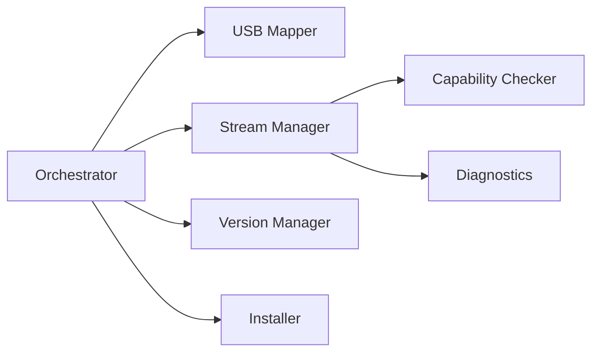

# Components Overview

LyreBirdAudio is built from specialized components that work together.

---

## Core Components

### [Orchestrator](orchestrator.md)
Unified management interface for all operations

### [Stream Manager](stream-manager.md)
Stream lifecycle management and automatic recovery

### [USB Audio Mapper](usb-audio-mapper.md)
Device persistence via udev rules

### [Capability Checker](capability-checker.md)
Hardware detection and capability testing

### [Diagnostics Tool](diagnostics.md)
System health monitoring and reporting

### [Version Manager](version-manager.md)
Git-based update and rollback management

### [MediaMTX Installer](installer.md)
MediaMTX server installation and setup

---

## Component Interaction

[Return to Main Documentation](../index.md)
