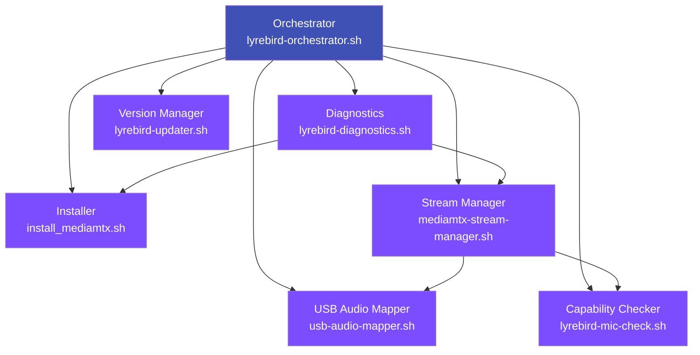

# Components Overview

LyreBirdAudio is built from seven specialized components that work together to provide a complete USB audio streaming solution. Each component follows the single-responsibility principle, handling one specific aspect of the system while integrating seamlessly with the others.

---

## Architecture

The components form a modular architecture where the Orchestrator serves as the user-facing interface, delegating operations to specialized components:



---

## Component Reference

| Component | Version | Purpose | Key Features |
|-----------|---------|---------|--------------|
| **[Orchestrator](orchestrator.md)** | 2.1.0 | Unified management interface | Interactive menu, Quick Setup Wizard, SHA256 integrity checking |
| **[Stream Manager](stream-manager.md)** | 1.4.1 | Stream lifecycle management | Individual/multiplex modes, auto-recovery, systemd integration |
| **[USB Audio Mapper](usb-audio-mapper.md)** | 1.2.1 | USB device persistence | Physical port mapping, udev rules, multiple identical devices |
| **[Capability Checker](capability-checker.md)** | 1.0.0 | Hardware capability detection | Non-invasive detection, 3 quality tiers, config generation |
| **[Diagnostics](diagnostics.md)** | 1.0.2 | System health validation | 20+ checks, 3 diagnostic modes, actionable reporting |
| **[Version Manager](version-manager.md)** | 1.5.1 | Git-based version control | Transaction-based updates, automatic rollback, stash management |
| **[Installer](installer.md)** | 2.0.1 | MediaMTX installation | Platform-aware, SHA256 verification, atomic updates |

---

## Core Components

<div class="grid" markdown>

<div markdown>
### :material-view-dashboard: [Orchestrator](orchestrator.md)

**Script:** `lyrebird-orchestrator.sh`

The central command interface providing interactive menu-driven management for all LyreBirdAudio operations. Ideal for initial setup, interactive troubleshooting, and accessing all other components through a unified interface.

**When to Use:**
- Initial system setup
- Interactive configuration changes
- Accessing diagnostic tools
- Viewing logs and status
- Learning the system

[Learn More →](orchestrator.md)
</div>

<div markdown>
### :material-play-network: [Stream Manager](stream-manager.md)

**Script:** `mediamtx-stream-manager.sh`

The core engine managing FFmpeg process lifecycle, health monitoring, and automatic recovery. Essential for all audio streaming operations with support for individual and multiplex streaming modes.

**When to Use:**
- Starting/stopping streams
- Production deployments (systemd)
- Health monitoring (cron)
- Multiplex streaming setup
- Stream status checking

[Learn More →](stream-manager.md)
</div>

<div markdown>
### :material-usb: [USB Audio Mapper](usb-audio-mapper.md)

**Script:** `usb-audio-mapper.sh`

Solves USB enumeration order problems by creating persistent udev rules based on physical USB port location. Ensures devices maintain consistent naming across reboots.

**When to Use:**
- Initial device setup
- Adding new USB devices
- After device name changes
- Handling identical devices
- Complex USB topologies

[Learn More →](usb-audio-mapper.md)
</div>

<div markdown>
### :material-chip: [Capability Checker](capability-checker.md)

**Script:** `lyrebird-mic-check.sh`

Non-invasive hardware capability detection that generates optimal configuration based on actual device capabilities. Eliminates configuration guesswork and prevents invalid settings.

**When to Use:**
- Initial configuration
- After hardware changes
- Configuration validation
- Quality tier selection
- Troubleshooting audio issues

[Learn More →](capability-checker.md)
</div>

<div markdown>
### :material-stethoscope: [Diagnostics](diagnostics.md)

**Script:** `lyrebird-diagnostics.sh`

Comprehensive system health validation with 20+ automated checks across system resources, USB devices, MediaMTX service, streams, and connectivity. Three modes for different use cases.

**When to Use:**
- Daily health checks
- Pre-deployment validation
- Troubleshooting issues
- GitHub issue preparation
- Weekly maintenance

[Learn More →](diagnostics.md)
</div>

<div markdown>
### :material-update: [Version Manager](version-manager.md)

**Script:** `lyrebird-updater.sh`

Safe git-based version management with transaction-based updates, automatic rollback, and systemd service coordination. Enables seamless upgrades and version switching.

**When to Use:**
- Checking for updates
- Upgrading to latest version
- Rolling back after issues
- Switching to specific version
- Testing development branches

[Learn More →](version-manager.md)
</div>

<div markdown>
### :material-download: [Installer](installer.md)

**Script:** `install_mediamtx.sh`

Platform-aware MediaMTX installation with automatic platform detection, SHA256 verification, and atomic updates with rollback capability. Supports Linux, macOS, and FreeBSD.

**When to Use:**
- Initial MediaMTX installation
- Updating MediaMTX version
- Verifying installation
- Installing specific versions
- Platform migration

[Learn More →](installer.md)
</div>

</div>

---

## Component Responsibilities

### Orchestrator: Delegation Only

The Orchestrator does **not** contain business logic for installation, mapping, streaming, or diagnostics. It serves solely as:

- User interface layer
- Menu presentation
- Input validation
- Delegation to specialized scripts
- SHA256 integrity verification of delegated scripts

**Example:**
```bash
# User selects "Map USB Devices" in orchestrator
# Orchestrator delegates to:
sudo ./usb-audio-mapper.sh
```

---

### Specialized Components: Business Logic

Each specialized component handles its specific domain:

| Component | Responsibility |
|-----------|---------------|
| **Installer** | MediaMTX installation lifecycle (download, verify, install, update, rollback) |
| **Stream Manager** | FFmpeg process management (start, stop, monitor, restart, health checks) |
| **USB Mapper** | Device persistence (USB detection, udev rules, symlink creation) |
| **Capability Checker** | Hardware capability detection (non-invasive ALSA queries, config generation) |
| **Diagnostics** | System health validation (20+ checks, 3 modes, reporting) |
| **Version Manager** | Version control operations (git operations, updates, rollback) |

---

## Integration Patterns

### Orchestrator → Component

```bash
# Orchestrator menu selection
Main Menu > 3. USB Device Management > 1. Map USB Devices

# Orchestrator delegates
sudo ./usb-audio-mapper.sh

# Component executes business logic
# - Detects USB devices
# - Creates udev rules
# - Generates symlinks
# - Returns to orchestrator
```

---

### Component → Component

```bash
# Stream Manager needs device capabilities
./mediamtx-stream-manager.sh start

# Internally calls capability checker
./lyrebird-mic-check.sh 0  # Check device 0 capabilities

# Uses results to configure FFmpeg
ffmpeg -f alsa -i hw:CARD=Device_1 -ar 48000 -ac 2 ...
```

---

### Diagnostics → All Components

```bash
# Diagnostics checks all components
./lyrebird-diagnostics.sh full

# Checks:
# - Installer: MediaMTX binary, version, service
# - USB Mapper: udev rules, symlinks
# - Capability Checker: Device detection
# - Stream Manager: FFmpeg processes, stream health
# - Version Manager: Git repository state
```

---

## Quick Setup Workflow

The typical setup workflow using components:


**Using Orchestrator:**
```bash
sudo ./lyrebird-orchestrator.sh
# Select "1. Quick Setup Wizard"
# Wizard runs all 6 steps automatically
```

**Manual Workflow:**
```bash
# 1. Install MediaMTX
sudo ./install_mediamtx.sh install

# 2. Map USB devices
sudo ./usb-audio-mapper.sh

# 3-4. Check capabilities and generate config
sudo ./lyrebird-mic-check.sh -g

# 5. Start streams
sudo ./mediamtx-stream-manager.sh start

# 6. Verify health
sudo ./lyrebird-diagnostics.sh quick
```

---

## Production Deployment

For production deployments, use components in this order:

### Initial Setup

1. **Version Manager** - Pin to specific stable tag
2. **Installer** - Install MediaMTX specific version
3. **USB Mapper** - Create persistent device mappings
4. **Capability Checker** - Generate validated configuration
5. **Stream Manager** - Install systemd service
6. **Diagnostics** - Verify all systems healthy

### Ongoing Maintenance

- **Daily:** Diagnostics (quick mode)
- **Weekly:** Diagnostics (full mode)
- **Monthly:** Version Manager (check for updates)
- **As Needed:** Stream Manager (health monitoring via cron)

---

## Troubleshooting Guide

### Problem: Can't find component scripts

**Solution:**
```bash
# Ensure you're in LyreBirdAudio directory
cd /path/to/LyreBirdAudio

# Make scripts executable
chmod +x *.sh

# Verify presence
ls -la *.sh
```

---

### Problem: Component execution fails

**Solution:**
```bash
# Check prerequisites
./lyrebird-diagnostics.sh quick

# Verify bash version (must be 4.0+)
bash --version

# Check permissions
ls -la /etc/mediamtx/
ls -la /var/log/
```

---

### Problem: Components out of sync

**Solution:**
```bash
# Update all components via Version Manager
./lyrebird-updater.sh
# Select "2. Upgrade to Latest Version"

# Verify versions match
./lyrebird-orchestrator.sh
# Select "6. Version & Update Management" > "1. Check Current Version"
```

---

## Development Guidelines

When modifying components, follow these principles:

### Single Responsibility

Each component should:
- Handle exactly one concern
- Not duplicate logic from other components
- Delegate to appropriate components when needed

**Example - Wrong:**
```bash
# Stream Manager should NOT detect USB devices
# That's USB Mapper's job
```

**Example - Right:**
```bash
# Stream Manager delegates to USB Mapper when needed
if ! usb_devices_mapped; then
    ./usb-audio-mapper.sh --test
fi
```

---

### Error Handling

All components should:
- Use consistent exit codes
- Provide actionable error messages
- Log errors to component-specific log files

**Example:**
```bash
# Installer exit codes
0: Success
1: General error
2: Platform not supported
3: Download failed
4: Checksum verification failed
```

---

### Orchestrator Integration

Components integrated with Orchestrator should:
- Support both interactive and non-interactive modes
- Return proper exit codes
- Handle EOF/stdin correctly
- Provide status output

---

## Related Documentation

- **[Getting Started: Quick Start](../getting-started/quick-start.md)** - Complete setup walkthrough
- **[Getting Started: Installation](../getting-started/installation.md)** - Detailed installation guide
- **[User Guide: Configuration](../user-guide/configuration.md)** - Configuration reference
- **[Advanced: Architecture](../advanced/architecture.md)** - Deep dive into system design
- **[Advanced: Troubleshooting](../advanced/troubleshooting.md)** - Comprehensive troubleshooting

---

## See Also

- [Main Documentation](../index.md)
- [Getting Started](../getting-started/quick-start.md)
- [User Guide](../user-guide/configuration.md)
- [Advanced Topics](../advanced/architecture.md)
