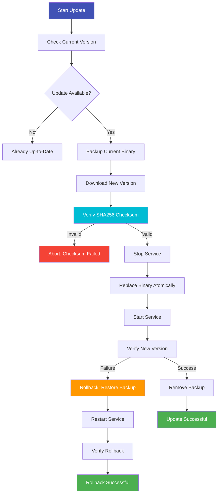

# MediaMTX Installer

**Script:** `install_mediamtx.sh`
**Version:** 2.0.1
**Purpose:** Install/update MediaMTX with rollback capability

---

## Overview

The MediaMTX Installer provides automated, platform-aware installation and updates for MediaMTX, the RTSP server that powers LyreBirdAudio streaming. It handles everything from downloading the correct platform binary to SHA256 verification, systemd service creation, and atomic updates with automatic rollback on failures.

!!! tip "Quick Start"
    For most users, simply run `sudo ./install_mediamtx.sh install` and the installer will detect your platform and install the latest MediaMTX version automatically.

---

## Key Features

<div class="grid" markdown>

<div markdown>
### Platform-Aware Installation
Automatic detection and installation for Linux, macOS (Darwin), and FreeBSD on x86_64, ARM64, ARMv7, and ARMv6 architectures.
</div>

<div markdown>
### GitHub Release Fetching
Fetches latest releases from MediaMTX GitHub repository with fallback parsers for reliability.
</div>

<div markdown>
### SHA256 Checksum Verification
Verifies download integrity with SHA256 checksums to prevent corrupted or tampered binaries.
</div>

<div markdown>
### Atomic Updates with Rollback
Transaction-based updates preserve old binary and automatically rollback on installation failures.
</div>

<div markdown>
### Systemd Service Management
Creates and manages systemd service files with proper user isolation and automatic startup configuration.
</div>

<div markdown>
### Dry-Run Mode
Preview what would be done without making any changes to the system, perfect for testing and validation.
</div>

</div>

---

## Usage

### Basic Commands

```bash
# Install latest version
sudo ./install_mediamtx.sh install

# Update existing installation to latest
sudo ./install_mediamtx.sh update

# Check installation status
./install_mediamtx.sh status

# Verify installation integrity
sudo ./install_mediamtx.sh verify

# Uninstall MediaMTX
sudo ./install_mediamtx.sh uninstall
```

### Install Specific Version

```bash
# Install specific version (e.g., v1.15.0)
sudo ./install_mediamtx.sh -V v1.15.0 install

# Update to specific version
sudo ./install_mediamtx.sh -V v1.15.0 update
```

### Custom Installation Options

```bash
# Install to custom prefix (default: /usr/local)
sudo ./install_mediamtx.sh -p /opt install

# Load configuration from file
sudo ./install_mediamtx.sh -c /path/to/config.sh install

# Force installation (skip verification)
sudo ./install_mediamtx.sh -f install

# Dry-run (show what would be done)
sudo ./install_mediamtx.sh -n install

# Quiet mode (suppress non-error output)
sudo ./install_mediamtx.sh -q install

# Verbose mode (debug output)
sudo ./install_mediamtx.sh -v install

# Skip systemd service creation
sudo ./install_mediamtx.sh --no-service install
```

---

## Installation Workflow

### Fresh Installation

**Step 1:** Run the installer

```bash
sudo ./install_mediamtx.sh install
```

**What Happens:**

1. **Platform Detection**
   ```
   Detected platform: Linux x86_64
   ```

2. **Fetch Latest Release**
   ```
   Fetching latest MediaMTX release from GitHub...
   Latest version: v1.15.0
   ```

3. **Download Binary**
   ```
   Downloading: mediamtx_v1.15.0_linux_amd64.tar.gz
   Download complete: 15.2 MB
   ```

4. **SHA256 Verification**
   ```
   Verifying checksum...
   SHA256: abc123def456... [OK]
   ```

5. **Extract and Install**
   ```
   Extracting archive...
   Installing to: /usr/local/bin/mediamtx
   Setting permissions...
   ```

6. **Configuration Setup**
   ```
   Creating config directory: /etc/mediamtx
   Generating default configuration...
   ```

7. **Service Creation**
   ```
   Creating systemd service...
   Creating service user: mediamtx
   Service file: /etc/systemd/system/mediamtx.service
   ```

8. **Verification**
   ```
   MediaMTX v1.15.0 installed successfully
   Binary: /usr/local/bin/mediamtx
   Config: /etc/mediamtx/mediamtx.yml
   Service: mediamtx.service
   ```

---

### Updating Existing Installation

**Step 2:** Update to latest version

```bash
sudo ./install_mediamtx.sh update
```

**What Happens:**

1. **Check Current Version**
   ```
   Current version: v1.14.0
   Latest version: v1.15.0
   Update available
   ```

2. **Backup Current Binary**
   ```
   Backing up current binary...
   Backup: /usr/local/bin/mediamtx.backup
   ```

3. **Download New Version**
   ```
   Downloading MediaMTX v1.15.0...
   ```

4. **Atomic Replacement**
   ```
   Stopping service...
   Replacing binary...
   Starting service...
   ```

5. **Verification**
   ```
   Verifying new installation...
   Update successful: v1.14.0 -> v1.15.0
   ```

**If Update Fails:**
```
Error during installation
Rolling back to previous version...
Restoring: /usr/local/bin/mediamtx.backup
Rollback successful: v1.14.0 restored
```

---

## Platform Support

### Supported Platforms

The installer automatically detects and installs the correct binary for your platform:

| Platform | Architectures | Notes |
|----------|---------------|-------|
| **Linux** | x86_64, ARM64, ARMv7, ARMv6 | Full support with systemd |
| **macOS (Darwin)** | x86_64, ARM64 (M1/M2) | Full support with launchd |
| **FreeBSD** | x86_64, ARM64 | Full support |

### Platform Detection

The installer automatically detects:

```bash
# Platform detection logic
OS=$(uname -s)      # Linux, Darwin, FreeBSD
ARCH=$(uname -m)    # x86_64, aarch64, armv7l, armv6l

# Mapping to MediaMTX binary names
Linux + x86_64  -> mediamtx_vX.X.X_linux_amd64.tar.gz
Linux + aarch64 -> mediamtx_vX.X.X_linux_arm64v8.tar.gz
Linux + armv7l  -> mediamtx_vX.X.X_linux_armv7.tar.gz
Linux + armv6l  -> mediamtx_vX.X.X_linux_armv6.tar.gz
Darwin + x86_64 -> mediamtx_vX.X.X_darwin_amd64.tar.gz
Darwin + arm64  -> mediamtx_vX.X.X_darwin_arm64.tar.gz
```

### ARM Platform Support

**Raspberry Pi Detection:**

The installer properly detects Raspberry Pi models and selects the correct ARM variant:

- **Raspberry Pi 4/5** -> ARM64v8 (if running 64-bit OS)
- **Raspberry Pi 3B+** -> ARMv7 (or ARM64 on 64-bit OS)
- **Raspberry Pi Zero/1** -> ARMv6

**Verification:**
```bash
# Check your platform
./install_mediamtx.sh status

# Example output
Platform: Linux armv7l (Raspberry Pi 3B+)
MediaMTX: v1.15.0 (linux_armv7)
```

---

## Installation Locations

### Default Installation

**Binary Location:**
```bash
/usr/local/bin/mediamtx
```

**Configuration Directory:**
```bash
/etc/mediamtx/
├── mediamtx.yml           # Main configuration
└── audio-devices.conf     # LyreBirdAudio device config
```

**Service Files:**
```bash
/etc/systemd/system/mediamtx.service
```

**Log Files:**
```bash
/var/log/mediamtx.out
```

### Custom Installation Prefix

```bash
# Install to /opt instead of /usr/local
sudo ./install_mediamtx.sh -p /opt install

# Results in:
/opt/bin/mediamtx           # Binary
/opt/etc/mediamtx/          # Configuration
```

---

## Options Reference

| Option | Description | Example |
|--------|-------------|---------|
| `-V <version>` | Install specific MediaMTX version | `-V v1.15.0` |
| `-p <prefix>` | Custom installation prefix | `-p /opt` |
| `-c <config>` | Load configuration from file | `-c /path/to/config.sh` |
| `-f, --force` | Force installation, skip verification | `-f` |
| `-n, --dry-run` | Show what would be done without changes | `-n` |
| `-q, --quiet` | Suppress non-error output | `-q` |
| `-v, --verbose` | Enable debug output | `-v` |
| `--no-service` | Skip systemd service creation | `--no-service` |

---

## Commands Reference

### install

**Purpose:** Fresh MediaMTX installation

**Usage:**
```bash
sudo ./install_mediamtx.sh install
```

**What It Does:**
- Downloads MediaMTX binary for your platform
- Verifies SHA256 checksum
- Installs binary to /usr/local/bin
- Creates configuration directory
- Generates default config file
- Creates systemd service
- Creates service user

**Prerequisites:**
- Root/sudo privileges
- Internet connectivity
- curl or wget installed

---

### update

**Purpose:** Update existing MediaMTX installation

**Usage:**
```bash
sudo ./install_mediamtx.sh update
```

**What It Does:**
- Checks for newer version
- Backs up current binary
- Downloads new version
- Stops service
- Replaces binary atomically
- Starts service
- Verifies new version
- Rolls back on failure

**Prerequisites:**
- MediaMTX already installed
- Root/sudo privileges

---

### status

**Purpose:** Check installation status and version

**Usage:**
```bash
./install_mediamtx.sh status
```

**Example Output:**
```
MediaMTX Installation Status
============================
Binary: /usr/local/bin/mediamtx
Version: v1.15.0
Platform: linux_amd64
Service: active (running)
Config: /etc/mediamtx/mediamtx.yml
Uptime: 3 days, 4 hours

Latest Available: v1.15.0 (up to date)
```

**No Sudo Required:** Status check doesn't modify system

---

### verify

**Purpose:** Verify installation integrity

**Usage:**
```bash
sudo ./install_mediamtx.sh verify
```

**What It Checks:**
- Binary exists and is executable
- Configuration file exists and is valid
- Service file exists (if systemd)
- Service user exists
- Binary version matches expected
- Permissions are correct

**Example Output:**
```
Verifying MediaMTX Installation
================================
[PASS] Binary: /usr/local/bin/mediamtx (executable)
[PASS] Version: v1.15.0
[PASS] Config: /etc/mediamtx/mediamtx.yml (valid YAML)
[PASS] Service: mediamtx.service (exists)
[PASS] Service User: mediamtx (exists)
[PASS] Permissions: correct

Verification successful
```

---

### uninstall

**Purpose:** Remove MediaMTX installation

**Usage:**
```bash
sudo ./install_mediamtx.sh uninstall
```

**What It Removes:**
- MediaMTX binary
- Configuration directory (optional prompt)
- Systemd service file
- Service user (optional prompt)

**Interactive Prompts:**
```
Remove MediaMTX binary? [Y/n]: y
  Removing: /usr/local/bin/mediamtx

Remove configuration directory? [y/N]: n
  Preserving: /etc/mediamtx/

Remove service file? [Y/n]: y
  Removing: /etc/systemd/system/mediamtx.service

Remove service user (mediamtx)? [y/N]: n
  Preserving user: mediamtx
```

**Safety:** Configuration preserved by default

---

## Systemd Service Management

### Service Creation

The installer creates a systemd service for MediaMTX:

**Service File:** `/etc/systemd/system/mediamtx.service`

```ini
[Unit]
Description=MediaMTX RTSP Server
After=network.target

[Service]
Type=simple
User=mediamtx
ExecStart=/usr/local/bin/mediamtx /etc/mediamtx/mediamtx.yml
Restart=always
RestartSec=10
StandardOutput=append:/var/log/mediamtx.out
StandardError=append:/var/log/mediamtx.out

[Install]
WantedBy=multi-user.target
```

### Service Management Commands

```bash
# Start service
sudo systemctl start mediamtx

# Stop service
sudo systemctl stop mediamtx

# Restart service
sudo systemctl restart mediamtx

# Enable automatic startup on boot
sudo systemctl enable mediamtx

# Disable automatic startup
sudo systemctl disable mediamtx

# Check service status
sudo systemctl status mediamtx

# View service logs
sudo journalctl -u mediamtx -f
```

### Service User

The installer creates a dedicated `mediamtx` user for security:

**User Details:**
- Username: `mediamtx`
- Home Directory: `/var/lib/mediamtx` (optional)
- Shell: `/usr/sbin/nologin` (no login shell)
- Purpose: Run MediaMTX with minimal privileges

**Verification:**
```bash
id mediamtx
# uid=999(mediamtx) gid=999(mediamtx) groups=999(mediamtx)
```

---

## Atomic Updates and Rollback

### Update Process



### Rollback Triggers

Automatic rollback occurs if:

1. **Binary Verification Fails**
   - New binary won't execute
   - Version mismatch detected

2. **Service Start Fails**
   - Service fails to start after update
   - Service crashes immediately

3. **Configuration Incompatibility**
   - New version rejects configuration
   - Config validation fails

**Manual Rollback:**
```bash
# If you need to manually rollback
sudo cp /usr/local/bin/mediamtx.backup /usr/local/bin/mediamtx
sudo systemctl restart mediamtx
```

### Backup Cleanup Policy

The installer automatically manages backup files to prevent unbounded disk usage:

**Automatic Cleanup:**
- Keeps the **last 3 backup files** (most recent)
- Removes backups older than **7 days** automatically
- Cleanup occurs after each successful installation
- No user intervention required

**Backup File Naming:**
```
/usr/local/bin/mediamtx.backup           # Latest backup
/usr/local/bin/mediamtx.backup.1         # Second most recent
/usr/local/bin/mediamtx.backup.2         # Third most recent
(Older backups are automatically removed)
```

**Manual Backup Management:**
```bash
# List all existing backups
ls -lh /usr/local/bin/mediamtx.backup*

# Manually remove old backups if needed
sudo rm /usr/local/bin/mediamtx.backup.2

# Create additional manual backup
sudo cp /usr/local/bin/mediamtx /usr/local/bin/mediamtx.manual-backup
```

**Note:** The automatic cleanup ensures production systems don't accumulate old backup files while still maintaining enough history for emergency rollback.

---

## SHA256 Verification

### Why Checksum Verification Matters

Ensures downloaded binaries are:
- **Authentic:** From official MediaMTX release
- **Untampered:** Not modified during download
- **Uncorrupted:** Complete and valid

### Verification Process

1. **Download Checksum File**
   ```bash
   # MediaMTX provides checksums.txt with each release
   curl -L https://github.com/bluenviron/mediamtx/releases/download/v1.15.0/checksums.txt
   ```

2. **Calculate Downloaded File Checksum**
   ```bash
   sha256sum mediamtx_v1.15.0_linux_amd64.tar.gz
   ```

3. **Compare Checksums**
   ```
   Expected: abc123def456789...
   Actual:   abc123def456789...
   Result:   MATCH [PASS]
   ```

4. **Proceed or Abort**
   - **Match:** Proceed with installation
   - **Mismatch:** Abort and report error

### Manual Verification

```bash
# Download binary
curl -L -o mediamtx.tar.gz https://github.com/bluenviron/mediamtx/releases/download/v1.15.0/mediamtx_v1.15.0_linux_amd64.tar.gz

# Download checksums
curl -L -o checksums.txt https://github.com/bluenviron/mediamtx/releases/download/v1.15.0/checksums.txt

# Verify
sha256sum -c checksums.txt --ignore-missing
# mediamtx_v1.15.0_linux_amd64.tar.gz: OK
```

---

## Dry-Run Mode

### Testing Installation

Preview what would happen without making changes:

```bash
sudo ./install_mediamtx.sh -n install
```

**Example Output:**
```
[DRY-RUN] Detected platform: Linux x86_64
[DRY-RUN] Would fetch latest MediaMTX release
[DRY-RUN] Would download: mediamtx_v1.15.0_linux_amd64.tar.gz
[DRY-RUN] Would verify SHA256 checksum
[DRY-RUN] Would extract to: /tmp/mediamtx-install-XXXX
[DRY-RUN] Would install binary to: /usr/local/bin/mediamtx
[DRY-RUN] Would create config directory: /etc/mediamtx
[DRY-RUN] Would generate config: /etc/mediamtx/mediamtx.yml
[DRY-RUN] Would create service: /etc/systemd/system/mediamtx.service
[DRY-RUN] Would create user: mediamtx

[DRY-RUN] Installation would succeed
```

**Use Cases:**
- Test before production deployment
- Verify permissions and paths
- Validate platform detection
- Debug installation issues

---

## Integration with Orchestrator

The Installer integrates with the Orchestrator for convenient access:

### Menu Access

```
Orchestrator Main Menu
├── 2. MediaMTX Installation & Updates
│   ├── 1. Install MediaMTX -> install_mediamtx.sh install
│   ├── 2. Update MediaMTX -> install_mediamtx.sh update
│   ├── 3. Check Installation Status -> install_mediamtx.sh status
│   ├── 4. Verify Installation -> install_mediamtx.sh verify
│   ├── 5. Uninstall MediaMTX -> install_mediamtx.sh uninstall
│   └── 6. Return to Main Menu
```

### Quick Setup Wizard Integration

The Quick Setup Wizard uses the installer as its first step:

```bash
Orchestrator Quick Setup Wizard
================================
[1/5] Installing MediaMTX...
      ├─ Detecting platform...
      ├─ Downloading latest version...
      ├─ Verifying checksum...
      ├─ Installing binary...
      ├─ Creating service...
      └─ MediaMTX v1.15.0 installed [PASS]

[2/5] Mapping USB devices...
[3/5] Generating configuration...
[4/5] Starting streams...
[5/5] Running diagnostics...

Setup complete!
```

---

## Troubleshooting

### Common Issues

#### Platform Not Supported

**Symptom:** `Error: Unsupported platform: <platform>`

**Solution:**
```bash
# Check your platform
uname -s  # Should be: Linux, Darwin, or FreeBSD
uname -m  # Should be: x86_64, aarch64, armv7l, or armv6l

# If unsupported, manual installation required
# Visit: https://github.com/bluenviron/mediamtx/releases
# Download appropriate binary for your platform
```

---

#### Download Failed

**Symptom:** `Error: Failed to download MediaMTX`

**Solutions:**
```bash
# Check internet connectivity
ping -c 3 github.com

# Check if curl/wget installed
command -v curl || sudo apt-get install curl

# Check GitHub API rate limits
curl https://api.github.com/rate_limit

# Try specific version (bypasses "latest" API call)
sudo ./install_mediamtx.sh -V v1.15.0 install

# Manual download if automated fails
curl -L -o /tmp/mediamtx.tar.gz \
  https://github.com/bluenviron/mediamtx/releases/download/v1.15.0/mediamtx_v1.15.0_linux_amd64.tar.gz
```

---

#### SHA256 Checksum Mismatch

**Symptom:** `Error: SHA256 checksum verification failed`

**Solutions:**
```bash
# Re-download (download may be corrupted)
sudo ./install_mediamtx.sh install

# Force installation (NOT RECOMMENDED for production)
sudo ./install_mediamtx.sh -f install

# Manual verification
curl -L https://github.com/bluenviron/mediamtx/releases/download/v1.15.0/checksums.txt
# Check if checksum file is valid
```

**Security Warning:** Never skip checksum verification in production environments

---

#### Service Creation Failed

**Symptom:** `Error: Failed to create systemd service`

**Solutions:**
```bash
# Check if systemd is available
systemctl --version

# If no systemd, skip service creation
sudo ./install_mediamtx.sh --no-service install

# Run MediaMTX manually
/usr/local/bin/mediamtx /etc/mediamtx/mediamtx.yml

# Check service file permissions
ls -la /etc/systemd/system/mediamtx.service
```

---

#### Permission Denied

**Symptom:** `Permission denied` during installation

**Solutions:**
```bash
# Ensure running with sudo
sudo ./install_mediamtx.sh install

# Check if /usr/local/bin is writable
ls -ld /usr/local/bin

# If not writable, fix permissions
sudo chmod 755 /usr/local/bin

# Or use custom prefix
sudo ./install_mediamtx.sh -p /opt install
```

---

## Best Practices

### Production Deployments

**1. Install Specific Versions**
```bash
# Pin to specific version, don't use "latest"
sudo ./install_mediamtx.sh -V v1.15.0 install
```

**2. Verify Installation**
```bash
# Always verify after installation
sudo ./install_mediamtx.sh verify
```

**3. Enable Service**
```bash
# Enable automatic startup
sudo systemctl enable mediamtx
```

**4. Test Before Updating**
```bash
# Test updates in staging first
sudo ./install_mediamtx.sh -V v1.16.0 update
# If successful, update production
```

---

### Update Strategy

```bash
# 1. Check current version
./install_mediamtx.sh status

# 2. Backup configuration
sudo cp /etc/mediamtx/mediamtx.yml /etc/mediamtx/mediamtx.yml.backup

# 3. Run update
sudo ./install_mediamtx.sh update

# 4. Verify update
./install_mediamtx.sh status

# 5. Test streams
./mediamtx-stream-manager.sh status

# 6. If issues, rollback
sudo cp /usr/local/bin/mediamtx.backup /usr/local/bin/mediamtx
sudo systemctl restart mediamtx
```

---

### Security Considerations

**1. Always Verify Checksums**
```bash
# Never skip verification in production
# BAD:  sudo ./install_mediamtx.sh -f install
# GOOD: sudo ./install_mediamtx.sh install
```

**2. Use Service User**
```bash
# MediaMTX should run as dedicated user, not root
systemctl status mediamtx | grep "Main PID"
ps -u mediamtx
```

**3. Restrict Permissions**
```bash
# Ensure config files are not world-writable
sudo chmod 644 /etc/mediamtx/mediamtx.yml
sudo chown root:mediamtx /etc/mediamtx/mediamtx.yml
```

---

## Related Documentation

- **[Orchestrator](orchestrator.md)** - Unified management interface with installer integration
- **[Version Manager](version-manager.md)** - LyreBirdAudio script updates (separate from MediaMTX)
- **[Stream Manager](stream-manager.md)** - Stream lifecycle management using MediaMTX
- **[Diagnostics](diagnostics.md)** - MediaMTX service health checks
- **[Getting Started: Installation](../getting-started/installation.md)** - Complete installation guide
- **[Maintenance: Version Management](../maintenance/version-management.md)** - Update procedures

---

## See Also

- [Getting Started: Quick Start](../getting-started/quick-start.md)
- [Getting Started: System Requirements](../getting-started/system-requirements.md)
- [Advanced: Troubleshooting](../advanced/troubleshooting.md)
- [Reference: Configuration Files](../reference/configuration-files.md)
