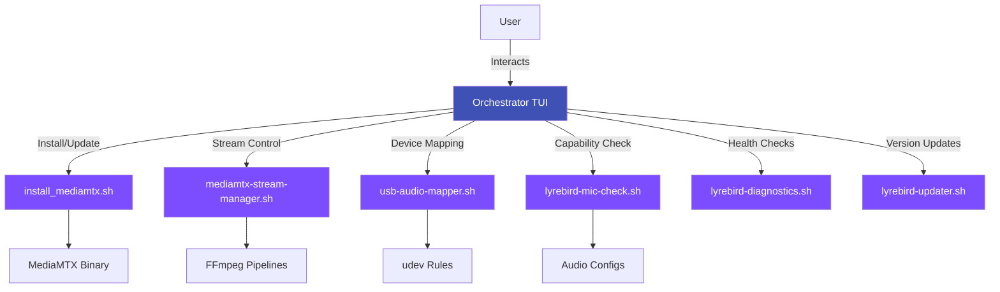

# Orchestrator

**Script:** `lyrebird-orchestrator.sh`
**Version:** 2.1.0
**Purpose:** Unified management interface for LyreBirdAudio

---

## Overview

The Orchestrator is the central command interface for LyreBirdAudio, providing an interactive menu-driven system for managing all aspects of your RTSP audio streaming infrastructure. It acts as a unified frontend that delegates to specialized scripts while maintaining no duplicate business logic.

!!! tip "Recommended Entry Point"
    The Orchestrator is the recommended way to manage LyreBirdAudio. It provides guided workflows for common tasks and integrates all components into a single coherent interface.

---

## Key Features

<div class="grid" markdown>

<div markdown>
### :material-auto-fix: Quick Setup Wizard
Complete installation from zero to streaming in minutes with automated guidance through all steps.
</div>

<div markdown>
### :material-check-circle: Device Capability Inspection
Automatically detect and validate hardware capabilities without manual configuration.
</div>

<div markdown>
### :material-chart-box: Real-Time System Status
Live monitoring of MediaMTX service, active streams, and system resources.
</div>

<div markdown>
### :material-shield-check: SHA256 Integrity Checking
Verify script integrity during updates to ensure secure operation.
</div>

<div markdown>
### :material-file-rotate: Auto Log Rotation
Automatic management of log files to prevent disk space issues.
</div>

<div markdown>
### :material-console: EOF/stdin Handling
Robust handling of user input with graceful error recovery.
</div>

</div>

---

## Usage

### Basic Invocation

```bash
sudo ./lyrebird-orchestrator.sh
```

!!! warning "Root Privileges Required"
    The Orchestrator requires root/sudo access for system-level operations like udev rule management, systemd service installation, and MediaMTX configuration.

---

## Main Menu Structure

When you launch the Orchestrator, you'll see an interactive menu:

```
========================================
LyreBirdAudio Orchestrator v2.1.0
========================================

Main Menu:
1. Quick Setup Wizard
2. MediaMTX Installation & Updates
3. USB Device Management
4. Audio Streaming Control
5. System Diagnostics
6. Version Management
7. Logs & Status
8. Exit

Select an option:
```

---

## Menu Options Explained

### 1. Quick Setup Wizard

The Quick Setup Wizard guides you through a complete installation:

**Wizard Steps:**

1. **MediaMTX Installation**
   - Detects your system architecture automatically
   - Downloads and installs the latest MediaMTX version
   - Configures the server for audio streaming
   - Creates systemd service

2. **USB Device Mapping**
   - Scans for connected USB audio devices
   - Creates persistent device names via udev rules
   - Maps devices to physical USB ports
   - Generates `/dev/snd/by-usb-port/*` symlinks

3. **Generate Optimal Configuration**
   - Runs hardware capability detection
   - Determines supported sample rates and formats
   - Creates `/etc/mediamtx/audio-devices.conf`
   - Sets quality tier (low/normal/high)

4. **Start Streams**
   - Launches FFmpeg pipelines for all detected devices
   - Validates RTSP connectivity
   - Confirms stream health via MediaMTX API

5. **Run Diagnostics**
   - Executes comprehensive system health check
   - Validates USB devices, MediaMTX service, RTSP connectivity
   - Reports any issues with remediation steps

**Usage:**
```bash
sudo ./lyrebird-orchestrator.sh
# Select: 1. Quick Setup Wizard
# Follow interactive prompts
```

---

### 2. MediaMTX Installation & Updates

Manage MediaMTX server installation and updates:

**Sub-Options:**

- **Install MediaMTX**: Fresh installation
- **Update MediaMTX**: Upgrade to latest version
- **Check MediaMTX Status**: Verify installation and running status
- **Verify MediaMTX**: Validate binary integrity with SHA256 checksums
- **Uninstall MediaMTX**: Complete removal (with confirmation)

**Delegated to:** `install_mediamtx.sh`

**Features:**
- Platform-aware installation (Linux/Darwin/FreeBSD)
- Architecture detection (x86_64, ARM64, ARMv7, ARMv6)
- GitHub release fetching with checksums
- Atomic updates with rollback capability
- Systemd service configuration

---

### 3. USB Device Management

Manage USB audio device persistence and mapping:

**Sub-Options:**

- **Map USB Devices**: Interactive device mapping wizard
- **List Mapped Devices**: Show all persistent device mappings
- **Test Device Detection**: Validate udev rules and device paths
- **Remove Mappings**: Clear all USB mappings

**Delegated to:** `usb-audio-mapper.sh`

**Features:**
- Physical USB port mapping
- Support for multiple identical devices
- udev rule generation
- Persistent naming across reboots

**Generated Files:**
- `/etc/udev/rules.d/99-usb-soundcards.rules`
- `/dev/snd/by-usb-port/Device_N` symlinks (after reboot)

---

### 4. Audio Streaming Control

Control stream lifecycle and configuration:

**Sub-Options:**

- **List Available Streams**: Show all configured streams
- **Add New Stream**: Create a new stream configuration
- **Remove Stream**: Delete a stream configuration
- **Start All Streams**: Launch all FFmpeg processes
- **Stop All Streams**: Gracefully terminate all streams
- **Restart All Streams**: Stop and start all streams
- **Stream Status**: Real-time status of all active streams
- **Multiplex Configuration**: Setup merged/mixed streams
- **Install Stream Manager Service**: Enable auto-start on boot

**Delegated to:** `mediamtx-stream-manager.sh`

**Features:**
- Individual and multiplex streaming modes
- Automatic health monitoring
- Process supervision with exponential backoff
- CPU and file descriptor monitoring
- Graceful shutdown procedures

---

### 5. System Diagnostics

Run comprehensive system health checks:

**Sub-Options:**

- **Quick Health Check**: Essential systems only (~30 seconds)
- **Full Diagnostic**: Comprehensive analysis (~2 minutes)
- **Debug Diagnostic**: Maximum verbosity for troubleshooting

**Delegated to:** `lyrebird-diagnostics.sh`

**Check Categories:**
- System info (OS, kernel, uptime, load)
- USB audio devices (detection, ALSA, mapping)
- MediaMTX service (binary, version, config, status)
- Stream status (active count, health, uptime)
- RTSP connectivity (port 8554, protocol validation)
- System resources (CPU, memory, file descriptors)
- Log analysis (errors, warnings, failures)
- Time synchronization (NTP, Chrony, drift)

---

### 6. Version Management

Manage script updates and rollbacks:

**Sub-Options:**

- **Check for Updates**: Compare local vs. remote versions
- **Upgrade to Latest**: Update to main branch HEAD
- **Switch to Specific Version**: Choose tag or branch
- **Rollback to Previous**: Revert to earlier version
- **Version Status**: Show current version and available updates

**Delegated to:** `lyrebird-updater.sh`

**Features:**
- Git-based version management
- Tagged release support
- Automatic stashing of local changes
- Transaction-based updates with rollback
- Systemd service coordination
- Self-update capability

---

### 7. Logs & Status

View logs and system status:

**Sub-Options:**

- **View MediaMTX Log**: Tail `/var/log/mediamtx.out`
- **View Stream Manager Log**: Tail `/var/log/mediamtx-stream-manager.log`
- **View Orchestrator Log**: Tail `/var/log/lyrebird-orchestrator.log`
- **View Stream Logs**: Tail individual FFmpeg logs from `/var/log/lyrebird/`
- **System Status Summary**: Comprehensive overview of all services
- **Resource Monitoring**: Real-time CPU, memory, file descriptor usage

---

## Architecture

### Design Philosophy

The Orchestrator follows the **Single-Responsibility Principle**:

- **No Business Logic**: Orchestrator contains only UI and delegation logic
- **Delegates to Specialists**: Each operation calls the appropriate specialized script
- **Consistent Error Handling**: Unified error reporting across all operations
- **Comprehensive Feedback**: Clear progress indicators and status messages



### Component Integration

The Orchestrator integrates all LyreBirdAudio components:

| Component | Purpose | Integration |
|-----------|---------|-------------|
| **MediaMTX Installer** | Server management | Direct invocation with status display |
| **Stream Manager** | Process lifecycle | Status queries and control commands |
| **USB Mapper** | Device persistence | Interactive and automated mapping |
| **Capability Checker** | Hardware detection | Auto-configuration generation |
| **Diagnostics** | System health | Scheduled checks with reporting |
| **Version Manager** | Script updates | Update coordination and rollback |

---

## Exit Codes

The Orchestrator uses standard exit codes for automation:

| Code | Meaning | Details |
|------|---------|---------|
| `0` | Success | Operation completed successfully |
| `1` | General Error | Operation failed (see error message) |
| `2` | Permission Denied | Requires root/sudo privileges |
| `3` | Missing Dependencies | Required utilities not installed |
| `4` | Script Not Found | Delegated script missing or not executable |

**Usage in Scripts:**
```bash
sudo ./lyrebird-orchestrator.sh
if [ $? -eq 0 ]; then
    echo "Success"
else
    echo "Failed with exit code $?"
fi
```

---

## Advanced Features

### Hardware Capability Integration

The Orchestrator integrates real-time hardware capability detection:

- Displays supported sample rates during configuration
- Warns about USB audio adapter chip limitations
- Recommends quality tiers based on hardware
- Validates configurations against actual capabilities

### SHA256 Integrity Verification

For security-conscious environments, the Orchestrator can verify script integrity:

```bash
# Enable integrity checking
export VERIFY_INTEGRITY=1
sudo ./lyrebird-orchestrator.sh
```

### Auto Log Rotation

The Orchestrator automatically manages its own logs:

- **Location:** `/var/log/lyrebird-orchestrator.log`
- **Rotation:** When exceeding 10MB
- **Retention:** Last 3 rotations kept
- **Compression:** Automatic gzip compression

---

## Typical Workflows

### First-Time Setup

```bash
# 1. Clone repository
git clone https://github.com/tomtom215/LyreBirdAudio.git
cd LyreBirdAudio

# 2. Make scripts executable
chmod +x *.sh

# 3. Run Orchestrator
sudo ./lyrebird-orchestrator.sh

# 4. Select Quick Setup Wizard
# Follow prompts for complete installation
```

### Adding a New USB Microphone

```bash
sudo ./lyrebird-orchestrator.sh
# 1. Main Menu → 3. USB Device Management
# 2. Select: Map USB Devices
# 3. Follow prompts to map new device
# 4. Reboot system for udev rules to take effect
# 5. Main Menu → 4. Audio Streaming Control
# 6. Select: Add New Stream
# 7. Choose newly mapped device
```

### Updating to Latest Version

```bash
sudo ./lyrebird-orchestrator.sh
# 1. Main Menu → 6. Version Management
# 2. Select: Check for Updates
# 3. Review changes
# 4. Select: Upgrade to Latest
# 5. Confirm update
# System will update and reload Orchestrator
```

### Troubleshooting a Stream Issue

```bash
sudo ./lyrebird-orchestrator.sh
# 1. Main Menu → 5. System Diagnostics
# 2. Select: Full Diagnostic
# 3. Review output for errors
# 4. Follow remediation steps
# 5. Main Menu → 7. Logs & Status
# 6. Select: View Stream Manager Log
# 7. Check for specific error messages
```

---

## Best Practices

!!! tip "Use Quick Setup Wizard for Initial Installation"
    The Quick Setup Wizard automates the entire installation process and ensures all steps are completed in the correct order.

!!! tip "Run Diagnostics After Changes"
    After any configuration change, run a quick health check to verify everything is working correctly.

!!! tip "Enable Stream Manager Service for Production"
    For 24/7 operation, always install the Stream Manager as a systemd service through the Orchestrator menu.

!!! warning "Always Review Diagnostic Output"
    Diagnostic reports provide actionable remediation steps. Follow them to resolve issues before they impact production.

---

## Troubleshooting

### Orchestrator Won't Start

**Symptoms:** Script fails immediately or shows permission errors

**Solutions:**
```bash
# Check if running as root
sudo -v

# Verify script is executable
chmod +x lyrebird-orchestrator.sh

# Check for missing dependencies
bash --version  # Must be 4.0+
command -v git ffmpeg curl
```

### Menu Options Don't Work

**Symptoms:** Selecting menu options results in "script not found" errors

**Solutions:**
```bash
# Ensure all scripts are in same directory
ls -la *.sh

# Make all scripts executable
chmod +x *.sh

# Verify no permission issues
ls -l lyrebird-orchestrator.sh
```

### Log File Errors

**Symptoms:** "Cannot write to log file" errors

**Solutions:**
```bash
# Create log directory
sudo mkdir -p /var/log/lyrebird

# Fix permissions
sudo chmod 755 /var/log/lyrebird

# Check disk space
df -h /var/log
```

---

## Related Documentation

- **[Stream Manager](stream-manager.md)** - FFmpeg process lifecycle management
- **[USB Audio Mapper](usb-audio-mapper.md)** - Device persistence configuration
- **[Capability Checker](capability-checker.md)** - Hardware detection details
- **[Diagnostics Tool](diagnostics.md)** - System health monitoring
- **[Version Manager](version-manager.md)** - Git-based updates
- **[MediaMTX Installer](installer.md)** - Server installation

---

## See Also

- [Getting Started: Quick Start](../getting-started/quick-start.md)
- [User Guide: Stream Management](../user-guide/stream-management.md)
- [Advanced: Troubleshooting](../advanced/troubleshooting.md)
- [Reference: Command Reference](../reference/command-reference.md)
