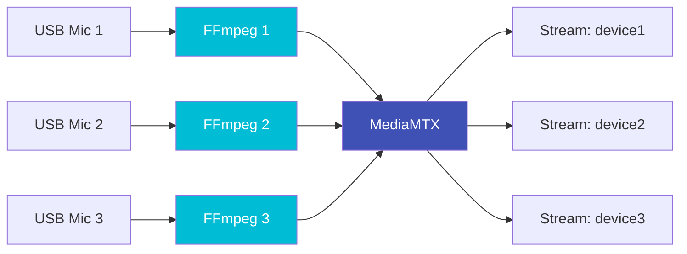
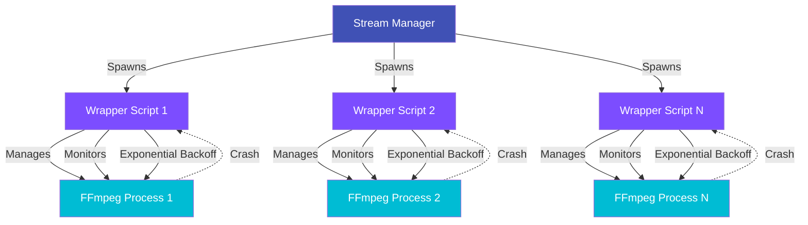

# Stream Manager

**Script:** `mediamtx-stream-manager.sh`
**Version:** 1.4.1
**Purpose:** Automatic stream configuration and lifecycle management

---

## Overview

The Stream Manager is the core engine of LyreBirdAudio, responsible for managing the entire lifecycle of FFmpeg audio streaming processes. It handles everything from initial stream creation to health monitoring, automatic recovery, and graceful shutdown.

!!!danger "Critical for Production"
    For 24/7 operation, continuous monitoring, or any production deployment, you **MUST** install the Stream Manager as a systemd service. Direct script execution is only suitable for testing and development.

---

## Key Features

<div class="grid" markdown>

<div markdown>
## Stream Lifecycle Management
Complete control over FFmpeg process creation, monitoring, and termination with graceful shutdown procedures.
</div>

<div markdown>
## Automatic Health Monitoring
Continuous stream health checks via MediaMTX API with automatic restart of failed streams.
</div>

<div markdown>
## Exponential Backoff Recovery
Intelligent restart delays (10s to 300s) prevent resource exhaustion from rapid failure loops.
</div>

<div markdown>
### Dual-Lookup Configuration
Support for both friendly device names and full device IDs ensures reliable configuration.
</div>

<div markdown>
### Lock-Based Concurrency
File-based locking prevents multiple instances from conflicting operations.
</div>

<div markdown>
## Resource Monitoring
Tracks CPU usage, file descriptors, and process counts with configurable thresholds.
</div>

</div>

---

## Usage

## Basic Commands

```bash
# Start all streams (individual mode)
sudo ./mediamtx-stream-manager.sh start

# Stop all streams gracefully
sudo ./mediamtx-stream-manager.sh stop

# Force stop all processes (emergency use - doesn't rely on graceful termination)
sudo ./mediamtx-stream-manager.sh force-stop

# Restart all streams
sudo ./mediamtx-stream-manager.sh restart

# Check stream status
sudo ./mediamtx-stream-manager.sh status

# View current configuration
sudo ./mediamtx-stream-manager.sh config

# Monitor stream health (for cron)
sudo ./mediamtx-stream-manager.sh monitor
```

## Multiplex Streaming

```bash
# Audio mixing mode (all mics -> single stereo stream)
sudo ./mediamtx-stream-manager.sh -m multiplex -f amix start

# Channel merging mode (preserve channel separation)
sudo ./mediamtx-stream-manager.sh -m multiplex -f amerge start

# Custom stream name
sudo ./mediamtx-stream-manager.sh -m multiplex -n studio start
```

## Systemd Service Installation

```bash
# Install as systemd service (REQUIRED for production)
sudo ./mediamtx-stream-manager.sh install

# Enable automatic startup on boot
sudo systemctl enable mediamtx-audio

# Start the service
sudo systemctl start mediamtx-audio

# Check service status
sudo systemctl status mediamtx-audio
```

---

## Streaming Modes

### Individual Mode (Default)

Each USB audio device gets its own dedicated RTSP stream.

**Usage:**
```bash
sudo ./mediamtx-stream-manager.sh start
```

**Result:**
```text
rtsp://your-server:8554/device1
rtsp://your-server:8554/device2
rtsp://your-server:8554/device3
```

**Best for:**
- Independent device monitoring
- Selective stream access
- Distributed recording
- Flexible client connections

**Architecture:**

**Individual Mode Data Flow:** Three USB microphones (USB Mic 1, 2, and 3) each connect to their own dedicated FFmpeg process (FFmpeg 1, 2, and 3, shown in cyan). All three FFmpeg processes feed their streams into the central MediaMTX server (purple). MediaMTX then creates three separate stream outputs (device1, device2, device3), allowing clients to connect to individual microphone streams. This one-to-one mapping between microphones, FFmpeg processes, and output streams provides maximum flexibility for selective monitoring.



---

### Multiplex Mode: Audio Mixing (amix)

Multiple microphones mixed into a single stereo stream.

**Usage:**
```bash
sudo ./mediamtx-stream-manager.sh -m multiplex -f amix start
```

**Result:**
```text
rtsp://your-server:8554/all_mics  (stereo, mixed audio)
```

**Characteristics:**
- **Output channels:** Fixed at 2 (stereo)
- **Channel separation:** Lost (all inputs mixed together)
- **Bandwidth:** Lower (single stream)
- **Best for:** Composite monitoring, single-stream recording

**Use Cases:**
- Monitoring multiple rooms with single VLC window
- Recording composite soundscape
- Bandwidth-constrained networks
- Simple playback requirements

**FFmpeg Filter Documentation:** [amix filter](https://ffmpeg.org/ffmpeg-filters.html#amix)

---

### Multiplex Mode: Channel Merging (amerge)

Multiple microphones merged while preserving individual channel separation.

**Usage:**
```bash
sudo ./mediamtx-stream-manager.sh -m multiplex -f amerge start
```

**Result:**
```text
rtsp://your-server:8554/all_mics  (N channels, separated)
```

**Characteristics:**
- **Output channels:** Sum of all input channels (e.g., 3 stereo mics = 6 channels)
- **Channel separation:** Preserved (forensic-grade separation)
- **Bandwidth:** Higher (more channels)
- **Best for:** Professional recording, spatial audio, forensic monitoring

**Use Cases:**
- Professional audio recording with post-processing
- Forensic analysis requiring channel isolation
- Spatial audio capture
- Multi-track recording

**Example:** 3 stereo microphones:
- Channels 1-2: Microphone 1 (left, right)
- Channels 3-4: Microphone 2 (left, right)
- Channels 5-6: Microphone 3 (left, right)

**FFmpeg Filter Documentation:** [amerge filter](https://ffmpeg.org/ffmpeg-filters.html#amerge-1)

---

## Mode Comparison

| Feature | Individual | amix | amerge |
|---------|-----------|------|--------|
| **Streams** | N streams | 1 stream | 1 stream |
| **Output channels** | Original | 2 (stereo) | Sum of inputs |
| **Channel separation** | N/A | Lost | Preserved |
| **Bandwidth** | N × bitrate | 1 × bitrate | 1 × (high bitrate) |
| **CPU usage** | Higher | Lower | Medium |
| **Client complexity** | Medium | Low | High |
| **Best for** | Flexibility | Monitoring | Professional recording |

---

## Exit Codes

The Stream Manager uses specific exit codes for automation and monitoring:

| Code | Meaning | Details |
|------|---------|---------|
| `0` | Success | Operation completed successfully |
| `1` | General Error | Operation failed (check logs) |
| `2` | Critical Resource State | Triggers automatic restart |
| `3` | Missing Dependencies | Required tools not installed |
| `4` | Configuration Error | Invalid audio-devices.conf |
| `5` | Lock Acquisition Failed | Another instance running |
| `6` | No USB Devices Found | No audio devices detected |
| `7` | MediaMTX Not Running | Server not accessible |
| `10` | Stream Monitoring Degraded | Health check detected issues |

**Usage in Scripts:**
```bash
sudo ./mediamtx-stream-manager.sh monitor
case $? in
    0) echo "All streams healthy" ;;
    10) echo "Degraded state, check logs" ;;
    *) echo "Critical failure, exit code $?" ;;
esac
```

---

## Configuration

## Configuration File

**Location:** `/etc/mediamtx/audio-devices.conf`

**Format:** Bash variable assignments

**Example:**
```bash
# Friendly name (easier to use)
DEVICE_USB_MICROPHONE_SAMPLE_RATE=48000
DEVICE_USB_MICROPHONE_CHANNELS=2
DEVICE_USB_MICROPHONE_BITRATE=128k
DEVICE_USB_MICROPHONE_CODEC=opus

# Full device ID (guaranteed unique)
DEVICE_USB_MANUFACTURER_MODEL_SERIAL_00000000_SAMPLE_RATE=48000
DEVICE_USB_MANUFACTURER_MODEL_SERIAL_00000000_CHANNELS=2
DEVICE_USB_MANUFACTURER_MODEL_SERIAL_00000000_BITRATE=192k
DEVICE_USB_MANUFACTURER_MODEL_SERIAL_00000000_CODEC=aac

# Fallback defaults (used when device-specific config missing)
DEFAULT_SAMPLE_RATE=48000
DEFAULT_CHANNELS=2
DEFAULT_BITRATE=128k
DEFAULT_CODEC=opus
DEFAULT_THREAD_QUEUE=8192
```

## Configuration Generation

```bash
# Auto-generate with normal quality
sudo ./lyrebird-mic-check.sh -g

# High quality (256kbps, 48kHz+)
sudo ./lyrebird-mic-check.sh -g --quality=high

# Low quality (64kbps, 16kHz for speech)
sudo ./lyrebird-mic-check.sh -g --quality=low
```

## Validate Configuration

```bash
# Validate against hardware capabilities
sudo ./lyrebird-mic-check.sh -V

# View effective configuration
sudo ./mediamtx-stream-manager.sh config
```

---

## Systemd Service Installation

### Why Systemd is Essential

!!! danger "Production Deployments Require Systemd"
    For continuous monitoring, bird song recording, or any 24/7 operation, systemd service installation is **mandatory**, not optional.

#### Comparison: Direct Execution vs. Systemd

| Feature | Direct Execution | Systemd Service |
|---------|------------------|-----------------|
| **Reboot survival** | NO - Streams stop | YES - Auto-start on boot |
| **Crash recovery** | NO - Manual restart required | YES - Automatic restart |
| **Process monitoring** | NO - None | YES - Continuous supervision |
| **Health checks** | NO - Manual | YES - Automated cron (5 min) |
| **System integration** | NO - No logging | YES - journald integration |
| **Resource limits** | NO - None | YES - Configured limits |
| **Graceful shutdown** | [NOTICE] Manual | YES - Automatic |
| **Production ready** | NO | YES |

#### When Direct Execution is Acceptable

- **One-time testing** of stream configuration
- **Development and debugging** with immediate control
- **Short-term manual recording** sessions
- **Troubleshooting** specific issues

#### When Systemd Service is Required

- **24/7 continuous operation**
- **Production bird song monitoring**
- **Unattended deployment**
- **Critical recording requirements**
- **Any deployment requiring reliability**

## Installation Steps

```bash
# Step 1: Install systemd service
sudo ./mediamtx-stream-manager.sh install

# Step 2: Enable automatic startup on boot
sudo systemctl enable mediamtx-audio

# Step 3: Start the service now
sudo systemctl start mediamtx-audio

# Step 4: Verify service is running
sudo systemctl status mediamtx-audio
```

**Expected Output:**
```text
● mediamtx-audio.service - MediaMTX Audio Stream Manager v1.4.1
     Loaded: loaded (/etc/systemd/system/mediamtx-audio.service; enabled)
     Active: active (running) since ...
   Main PID: 12345
      Tasks: 15 (limit: 4915)
     Memory: 234.5M
        CPU: 2min 15.234s
     CGroup: /system.slice/mediamtx-audio.service
             ├─12345 /bin/bash /path/to/mediamtx-stream-manager.sh start
             ├─12346 ffmpeg -f alsa -i hw:CARD=Device_1 ...
             └─12347 ffmpeg -f alsa -i hw:CARD=Device_2 ...
```

## Service Management

```bash
# View live logs
sudo journalctl -u mediamtx-audio -f

# View last 100 lines
sudo journalctl -u mediamtx-audio -n 100

# Restart service (apply configuration changes)
sudo systemctl restart mediamtx-audio

# Stop service
sudo systemctl stop mediamtx-audio

# Disable automatic startup
sudo systemctl disable mediamtx-audio

# Check service status
sudo systemctl status mediamtx-audio
```

## Cron Monitoring

The systemd installation automatically creates `/etc/cron.d/mediamtx-monitor` with production-grade safety:

```bash
*/5 * * * * root flock -n /run/mediamtx-monitor.lock -c '${SCRIPT_DIR}/${SCRIPT_NAME} monitor; EXIT=$?; if [ $EXIT -eq 2 ]; then systemctl restart mediamtx-audio; elif [ $EXIT -ne 0 ]; then logger -t mediamtx-monitor "Non-critical exit code $EXIT (no restart)"; fi' || logger -t mediamtx-monitor "Monitor already running or locked"
```

**Key Features:**
- **flock-based overlap protection**: Prevents concurrent monitor runs
- **Conditional restart logic**: Only restarts service on exit code 2 (critical resources)
- **Logging via syslog**: Uses `logger` for system integration, not file redirection
- **Error handling**: Non-critical errors logged but don't trigger restart

**Monitoring actions:**
- Checks stream health every 5 minutes
- Detects degraded states (FFmpeg accumulation, resource exhaustion)
- Automatically restarts service ONLY on critical issues (exit code 2)
- Logs all actions to syslog for audit trail

---

## Process Supervision

### Wrapper-Based Architecture

The Stream Manager uses a sophisticated wrapper-based process supervision system:

**Process Supervision Architecture:** The Stream Manager (purple, top) spawns three Wrapper Scripts (purple, middle layer), one for each audio device. Each wrapper script manages and monitors its own FFmpeg Process (cyan, bottom layer). The wrappers continuously monitor their FFmpeg processes, and if a crash is detected (shown by dotted lines), the wrapper implements exponential backoff before restarting the FFmpeg process. This three-tier architecture provides resilient process management where each stream can fail and recover independently without affecting others.



## Exponential Backoff Strategy

When a stream fails, the wrapper implements exponential backoff:

| Restart Attempt | Delay | Cumulative Time |
|-----------------|-------|-----------------|
| 1 | 10 seconds | 10s |
| 2 | 20 seconds | 30s |
| 3 | 40 seconds | 70s |
| 4 | 80 seconds | 2m 30s |
| 5 | 160 seconds | 5m 10s |
| 6+ | 300 seconds (cap) | 10m+ |

**Maximum Restarts:** 50 (configurable via `MAX_WRAPPER_RESTARTS`)

**Benefits:**
- Prevents rapid failure loops consuming resources
- Allows time for transient issues to resolve
- Provides breathing room for system recovery
- Limits resource exhaustion

---

## Related Documentation

- [Orchestrator](orchestrator.md) - Unified management interface
- [USB Audio Mapper](usb-audio-mapper.md) - Device persistence
- [Capability Checker](capability-checker.md) - Hardware detection
- [User Guide: Stream Management](../user-guide/stream-management.md) - Operational guide
- [User Guide: Multiplex Streaming](../user-guide/multiplex-streaming.md) - Multiplex modes explained
- [Advanced: Performance Tuning](../advanced/performance.md) - Optimization guide
- [Reference: Configuration Files](../reference/configuration-files.md) - Config reference

---

## See Also

- [Getting Started: Basic Usage](../getting-started/basic-usage.md)
- [Advanced: Troubleshooting](../advanced/troubleshooting.md)
- [Maintenance: Version Management](../maintenance/version-management.md)
