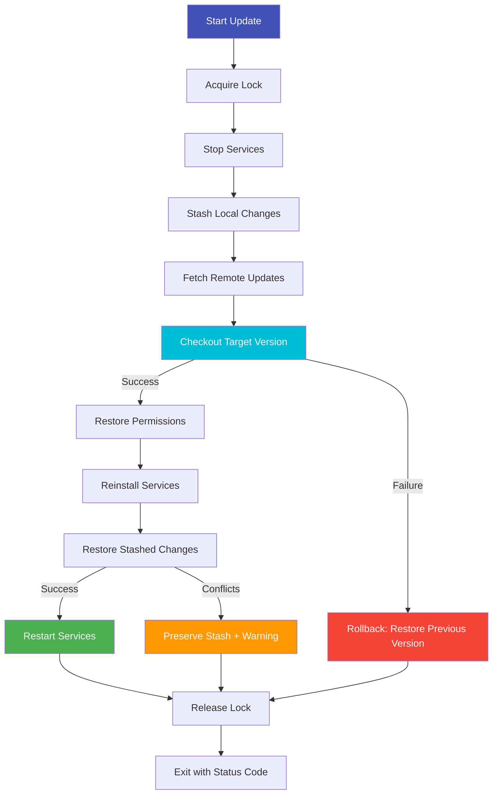
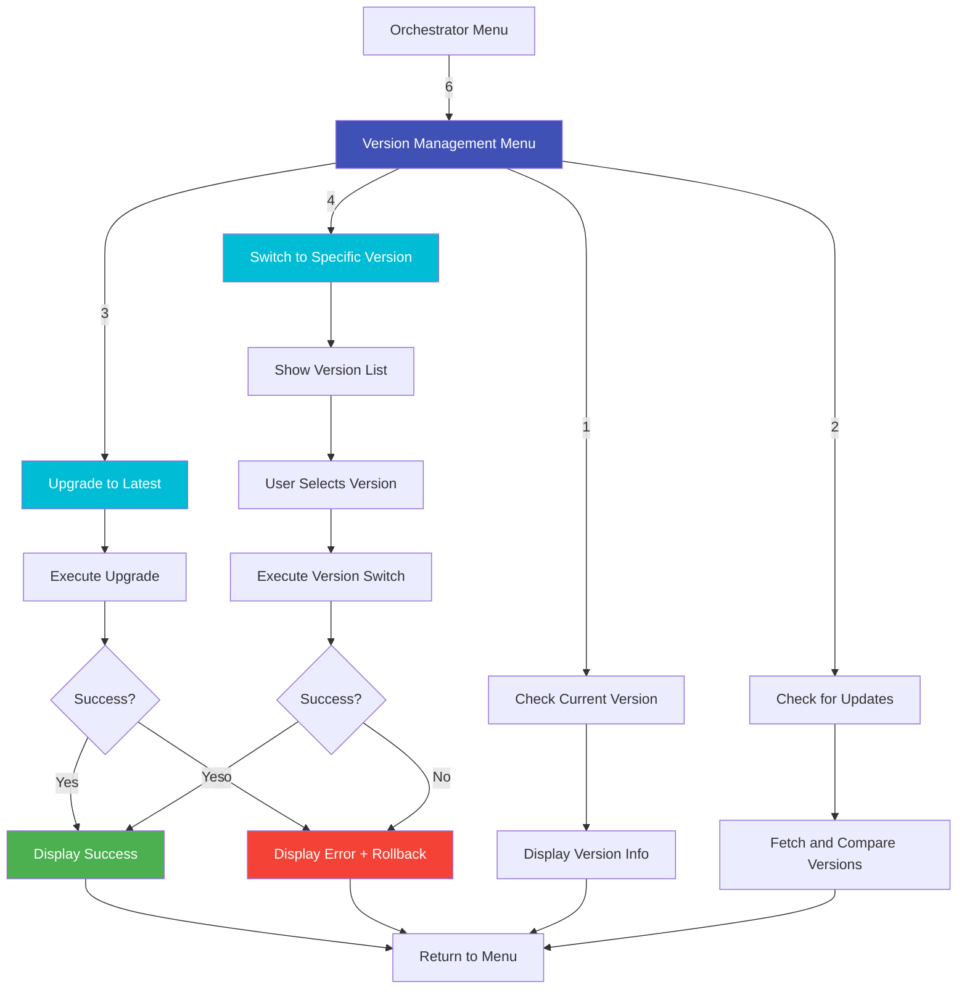

# Version Manager

**Script:** `lyrebird-updater.sh`
**Version:** 1.5.1
**Purpose:** Safe version management with git-based rollback

---

## Overview

The Version Manager provides safe, transactional version management for LyreBirdAudio deployments. Built on git, it enables seamless upgrades, downgrades, and branch switching while automatically handling systemd services, stashed changes, and rollback on failures.

!!! tip "Production Best Practice"
    Always pin production deployments to specific tagged releases (e.g., v1.2.0). Test newer versions in staging before upgrading production systems.

---

## Key Features

<div class="grid" markdown>

<div markdown>
### Git-Based Version Control
Complete version history with branch and tag switching, enabling instant rollback to any previous version.
</div>

<div markdown>
## Transaction-Based Updates
Atomic updates with automatic rollback on failures ensure system integrity during version changes.
</div>

<div markdown>
## Systemd Service Coordination
Automatically stops services before updates, reinstalls service files after version changes, and restarts services.
</div>

<div markdown>
### Self-Update Capability
Updates itself when the updater script changes, with syntax validation to prevent broken updaters.
</div>

<div markdown>
## Stash Management
Automatically stashes local changes before updates and restores them after, with conflict detection.
</div>

<div markdown>
## Concurrent Execution Protection
Lock file prevents multiple updater instances from running simultaneously and corrupting git state.
</div>

</div>

---

## Usage

## Interactive Menu

```bash
# Launch interactive menu
./lyrebird-updater.sh

# Menu options:
# 1) Switch to Latest Stable Release
# 2) Switch to Development Version (develop/main)
# 3) Switch to Specific Version or Branch
# 4) Check for New Updates
# 5) Show Detailed Status
# 6) Discard All Changes & Reset
```

## Command-Line Options

```bash
# Check current version and update status
./lyrebird-updater.sh --status

# List all available versions (tags and branches)
./lyrebird-updater.sh --list

# Show help and usage information
./lyrebird-updater.sh --help
```

!!! note "User Privileges"
    The updater should be run as a normal user (not root). The script does NOT use `sudo` internally - ensure you have necessary permissions before running.

---

## Update Workflow

### Check for Updates

**Step 1:** Check current version and available updates

```bash
./lyrebird-updater.sh --status
```

**Example Output:**
```text
=== Repository Status ===

Current State:
  Status:     On branch main
  Version:    v1.2.0

Working Directory:
  Status:     clean

Repository Info:
  Remote:     https://github.com/tomtom215/LyreBirdAudio.git
  Last fetch: 2 hours ago

Systemd Service:
  Service:    mediamtx-audio
  Status:     running
  Enabled:    yes
```

---

### Upgrade to Latest Version

**Step 2:** Upgrade to the latest stable release

```bash
./lyrebird-updater.sh
# Select option 2: Upgrade to Latest Version
```

**What Happens:**
1. Fetches latest version information from remote
2. Stops running mediamtx-audio service (if running)
3. Stashes any local changes with `-u` flag (includes untracked files)
4. Checks out latest tag
5. Restores executable permissions on specific scripts:
   - install_mediamtx.sh
   - lyrebird-orchestrator.sh
   - lyrebird-updater.sh
   - mediamtx-stream-manager.sh
   - usb-audio-mapper.sh
6. Reinstalls systemd service files (if customizations detected)
7. Restores stashed changes (if any)
8. Restarts mediamtx-audio service (only one service managed)
9. Displays updated version information

---

## Switch to Specific Version

**Step 3:** Switch to a specific tag or branch

```bash
./lyrebird-updater.sh
# Select option 3: Switch to Specific Version
# Choose from available versions
```

**Use Cases:**
- Rollback to previous stable version after problematic update
- Test specific development branch
- Deploy specific version required by deployment policy
- Investigate historical behavior or bugs

---

## Branch Structure

### Production Deployments: Tags

**Recommended:** Use tagged releases for production

```bash
# List available tags
./lyrebird-updater.sh --list | grep "v[0-9]"

# Example tags
v1.0.0  - Initial stable release
v1.1.0  - Feature additions
v1.2.0  - Current stable
v1.3.0  - Latest stable
```

**Characteristics:**
- Thoroughly tested and validated
- Production-ready with known behavior
- Recommended for 24/7 operations
- No unexpected changes
- Documented release notes

**Best for:**
- Production deployments
- Critical monitoring systems
- Bird song recording installations
- Any system requiring stability

---

## Latest Features: main Branch

**Use with caution:** Contains newest functionality

```bash
# Switch to main branch
./lyrebird-updater.sh
# Select option 3: Switch to Specific Version
# Choose "main"
```

**Characteristics:**
- Contains newest functionality
- Generally stable but may be work-in-progress
- Suitable for testing new features
- May have minor issues being resolved
- Updated frequently

**Best for:**
- Testing new features
- Staging environments
- Non-critical deployments
- Development systems

---

## Unstable Testing: development Branch

**Not recommended for production:** Active development code

```bash
# Switch to development branch (testing only)
./lyrebird-updater.sh
# Select option 3: Switch to Specific Version
# Choose "development"
```

**Characteristics:**
- Active development code
- May contain breaking changes
- For testing and development only
- Stability not guaranteed
- Features may be incomplete

**Best for:**
- Development and testing
- Feature previews
- Contributing to the project
- **NOT suitable for production**

---

## Update Behavior

## Automatic Stash Management

**Before Update:**
```bash
# Automatically stashes uncommitted and untracked changes
git stash push -u -m "Auto-stash before version switch"
```
**Note:** The `-u` flag includes untracked files in the stash.

**After Update:**
```bash
# Attempts to restore stashed changes
git stash pop

# If conflicts detected:
# - Preserves stash for manual resolution
# - Displays conflict warning
# - Provides instructions for resolution
```

## Conflict Resolution

If stashed changes conflict with new version:

```bash
# View stashed changes
git stash list

# Apply stash manually
git stash apply stash@{0}

# Resolve conflicts, then
git add <resolved-files>
git stash drop stash@{0}
```

---

## Permission Preservation

After version switch, executable permissions are automatically restored for core scripts:

```bash
chmod +x install_mediamtx.sh
chmod +x lyrebird-orchestrator.sh
chmod +x lyrebird-updater.sh
chmod +x mediamtx-stream-manager.sh
chmod +x usb-audio-mapper.sh
chmod +x lyrebird-mic-check.sh
chmod +x lyrebird-diagnostics.sh
```

This ensures all critical scripts remain executable after git operations that may reset permissions.

---

### Self-Update Capability

When the updater script itself changes:

1. Detects updater script modification
2. Performs syntax validation (`bash -n lyrebird-updater.sh`)
3. Re-executes updated version
4. Continues with requested operation

**Benefits:**
- Always uses latest updater logic
- Prevents broken updater from being executed
- Seamless update experience

---

## Systemd Service Coordination

**Before Version Switch:**
```bash
# Stop running service (mediamtx-audio only)
systemctl stop mediamtx-audio 2>/dev/null
```

**After Version Switch:**
```bash
# Reinstall service files (if customizations detected)
./mediamtx-stream-manager.sh install

# Restart service
systemctl start mediamtx-audio 2>/dev/null
```

**Important Notes:**
- Script does NOT use `sudo` - assumes user has necessary permissions
- Only manages `mediamtx-audio` service (NOT a separate `mediamtx` service)
- Service reinstallation is conditional (only if customizations detected)
- Service files may change between versions
- Ensures clean service state after updates

---

## Transaction-Based Operations

All version changes are transaction-based:

**Transaction-Based Update Workflow:** The update process begins at "Start Update" (purple) and acquires a lock to prevent concurrent updates. Services are stopped, and local changes are stashed before fetching remote updates and checking out the target version (cyan). If successful, the flow proceeds to restore permissions and reinstall services. If the checkout fails (red), the system rolls back to restore the previous version. After permissions are restored, stashed changes are applied back. If this succeeds, services restart (green); if conflicts occur, the stash is preserved with a warning (orange). Both paths release the lock and exit with a status code. This workflow ensures atomic updates where failures trigger automatic rollback to maintain system integrity.



---

## Lock File Protection

Prevents concurrent executions:

```bash
# Lock file location (in script directory, NOT /var/lock)
${SCRIPT_DIR}/.lyrebird-updater.lock

# If lock exists
# - Checks if process is still running
# - Exits with code 7 if locked
# - Auto-removes stale locks
```

**Benefits:**
- Prevents git repository corruption
- Avoids conflicting service operations
- Ensures clean update state

---

## Version Requirements

## Git Repository Required

!!! danger "Installation Method Requirement"
    The Version Manager **only works with git clone installations**. It is not compatible with standalone tarball installations.

**Valid Installation:**
```bash
# Git clone (supports version management)
git clone https://github.com/tomtom215/LyreBirdAudio.git
cd LyreBirdAudio
./lyrebird-updater.sh
```

**Invalid Installation:**
```bash
# Tarball download (NO version management support)
wget https://github.com/tomtom215/LyreBirdAudio/archive/main.tar.gz
tar -xzf main.tar.gz
cd LyreBirdAudio-main
./lyrebird-updater.sh  # Will fail with exit code 3
```

---

## Prerequisites

**Required:**
- Git 2.0+ installed
- Git repository with remote origin configured
- Internet connectivity for fetching updates

**Verification:**
```bash
# Check git version
git --version
# Should show: git version 2.x.x or higher

# Check remote origin
git remote -v
# Should show: origin URL
```

**Installation:**
```bash
# Ubuntu/Debian
sudo apt-get install git

# CentOS/RHEL/Fedora
sudo yum install git

# macOS
brew install git
```

---

## Exit Codes

The Version Manager uses specific exit codes for automation:

| Code | Meaning | Details |
|------|---------|---------|
| `0` | Success | Version operation completed successfully |
| `1` | General Error | Operation failed (check error message) |
| `2` | Prerequisites Not Met | Git not installed or version too old |
| `3` | Not a Git Repository | Must run from within git clone |
| `4` | No Remote Configured | Repository missing remote origin |
| `5` | Permission Error | Insufficient permissions for operation |
| `7` | Locked | Another updater instance running |
| `8` | Bad Git State | Git repository in inconsistent state |
| `9` | User Aborted | User cancelled operation |

### Usage in Automation

```bash
# Check for updates and upgrade if available
./lyrebird-updater.sh --status | grep -q "Update available"
if [ $? -eq 0 ]; then
    echo "Update available, upgrading..."
    ./lyrebird-updater.sh <<EOF
2
EOF
    EXIT_CODE=$?

    case $EXIT_CODE in
        0)
            echo "Upgrade successful"
            ;;
        7)
            echo "Update already in progress"
            ;;
        *)
            echo "Upgrade failed with code $EXIT_CODE"
            ;;
    esac
fi
```

---

## Rollback Procedures

## Immediate Rollback

If an update causes issues, immediately roll back to previous version:

```bash
./lyrebird-updater.sh
# Select option 3: Switch to Specific Version
# Choose previous stable tag (e.g., v1.2.0)
```

## Identifying Previous Version

```bash
# View git history
git reflog

# Example output:
# abc1234 HEAD@{0}: checkout: moving from v1.2.0 to v1.3.0
# def5678 HEAD@{1}: checkout: moving from v1.1.0 to v1.2.0

# Previous version was v1.2.0
./lyrebird-updater.sh
# Select option 3, choose v1.2.0
```

## Recovering Stashed Changes

If changes were stashed during problematic update:

```bash
# List stashed changes
git stash list

# Example output:
# stash@{0}: On main: Auto-stash before version switch
# stash@{1}: WIP on v1.2.0: Custom configuration

# Apply specific stash
git stash apply stash@{0}

# Or pop (apply and remove)
git stash pop stash@{0}
```

---

## Manual Version Management

While the updater script handles complexity, manual git operations are possible:

```bash
# Fetch latest updates
git fetch origin

# List available tags
git tag -l

# Checkout specific version
git checkout v1.2.0

# Restore permissions (specific scripts only)
chmod +x install_mediamtx.sh lyrebird-orchestrator.sh lyrebird-updater.sh mediamtx-stream-manager.sh usb-audio-mapper.sh

# Reinstall services
./mediamtx-stream-manager.sh install
```

!!! warning "Not Recommended"
    Manual version management bypasses safety features like transaction rollback, stash management, and service coordination. Use the updater script whenever possible.

---

## Integration with Orchestrator

The Version Manager integrates with the Orchestrator for convenient access:

## Menu Access

```text
Orchestrator Main Menu
├── 6. Version Management
│   ├── 1. Launch Update Manager (Interactive) ──> updater.sh (full menu)
│   │   ├── Option 1: Switch to Latest Stable Release
│   │   ├── Option 2: Switch to Development Version
│   │   ├── Option 3: Switch to Specific Version or Branch
│   │   ├── Option 4: Check for New Updates
│   │   ├── Option 5: Show Detailed Status
│   │   └── Option 6: Discard All Changes & Reset
│   ├── 2. Show Component Versions ────────────> Version info display
│   └── 0. Back to Main Menu
```

## Orchestrator Integration Flow

**Version Management Decision Flow:** From the Orchestrator Menu (option 6), users access the Version Management Menu (purple). They can check the current version, check for updates, upgrade to latest, or switch to a specific version. Checking current version and updates leads to displaying information. Upgrading executes the upgrade process, which can succeed (green) showing success or fail (red) showing error with rollback. Switching to a specific version shows a version list, user selects a version, and executes the version switch, which also has success/failure paths. All outcomes return to the menu, creating a complete version management workflow with clear success and failure handling.



---

## Troubleshooting

## Common Issues

### Not a Git Repository (Exit Code 3)

**Symptom:** `Error: Not a git repository`

**Solution:**
```bash
# You must reinstall using git clone
cd /path/to/installation/directory
cd ..
rm -rf LyreBirdAudio  # Backup first if you have local changes

# Clone from git
git clone https://github.com/tomtom215/LyreBirdAudio.git
cd LyreBirdAudio
./lyrebird-updater.sh
```

---

## No Remote Configured (Exit Code 4)

**Symptom:** `Error: No remote origin configured`

**Solution:**
```bash
# Add remote origin
git remote add origin https://github.com/tomtom215/LyreBirdAudio.git

# Verify
git remote -v

# Try update again
./lyrebird-updater.sh
```

---

## Another Instance Running (Exit Code 7)

**Symptom:** `Error: Another updater instance is running`

**Solution:**
```bash
# Check if process actually running
ps aux | grep lyrebird-updater

# If no process found, remove stale lock (lock is in script directory)
rm -f .lyrebird-updater.lock

# Try again
./lyrebird-updater.sh
```

---

## Bad Git State (Exit Code 8)

**Symptom:** `Error: Git repository in bad state`

**Solution:**
```bash
# Check git status
git status

# If detached HEAD
git checkout main

# If conflicts exist
git reset --hard origin/main

# If corrupted
git fsck --full

# Try update again
./lyrebird-updater.sh
```

---

## Merge Conflicts After Stash Pop

**Symptom:** Conflicts when restoring stashed changes

**Solution:**
```bash
# View conflict files
git status

# Edit conflict files to resolve
# Look for conflict markers:
# <<<<<<< Updated upstream
# ... new code ...
# =======
# ... your code ...
# >>>>>>> Stashed changes

# After resolving
git add <resolved-files>

# Remove stash
git stash drop
```

---

## Permission Errors (Exit Code 5)

**Symptom:** `Permission denied` during update

**Solution:**
```bash
# Ensure repository ownership is correct
ls -la .git/config

# Fix ownership if needed
sudo chown -R $USER:$USER .

# Try update again (as normal user)
./lyrebird-updater.sh
```

---

## Best Practices

## Production Deployments

**1. Pin to Specific Tags**
```bash
# Don't use: main, development, or latest
# Do use: v1.2.0, v1.3.0, etc.
./lyrebird-updater.sh
# Select option 3, choose specific tag
```

**2. Test in Staging First**
```bash
# Staging environment
cd /staging/LyreBirdAudio
./lyrebird-updater.sh
# Upgrade to latest, test thoroughly

# If successful, upgrade production
cd /production/LyreBirdAudio
./lyrebird-updater.sh
# Upgrade to same version tested in staging
```

**3. Schedule Updates During Maintenance Windows**
```bash
# Not during peak monitoring hours
# Schedule downtime notification
# Backup configuration before update
```

---

## Backup Before Updates

```bash
# Backup configuration files
tar -czf lyrebird-config-backup-$(date +%Y%m%d).tar.gz \
    /etc/mediamtx/audio-devices.conf \
    /etc/mediamtx/mediamtx.yml \
    /etc/udev/rules.d/99-usb-soundcards.rules

# Note current version
./lyrebird-updater.sh --status > version-before-update.txt

# Perform update
./lyrebird-updater.sh

# If issues occur, rollback
./lyrebird-updater.sh
# Select option 3, choose previous version
```

---

## Monitor Update Logs

```bash
# View git operation history
git reflog

# View stash history
git stash list

# Check systemd service status after update
sudo systemctl status mediamtx-audio
sudo systemctl status mediamtx

# Verify streams are running
sudo ./mediamtx-stream-manager.sh status
```

---

## Related Documentation

- [Orchestrator](orchestrator.md) - Unified management interface with version management integration
- [Installer](installer.md) - MediaMTX installation and updates
- [Stream Manager](stream-manager.md) - Service reinstallation after updates
- [Maintenance: Version Management](../maintenance/version-management.md) - Detailed update procedures
- [Maintenance: Backup & Restore](../maintenance/backup-restore.md) - Backup strategies before updates
- [Advanced: Custom Integration](../advanced/custom-integration.md) - Automated update workflows

---

## See Also

- [Getting Started: Installation](../getting-started/installation.md)
- [Getting Started: Basic Usage](../getting-started/basic-usage.md)
- [Advanced: Troubleshooting](../advanced/troubleshooting.md)
