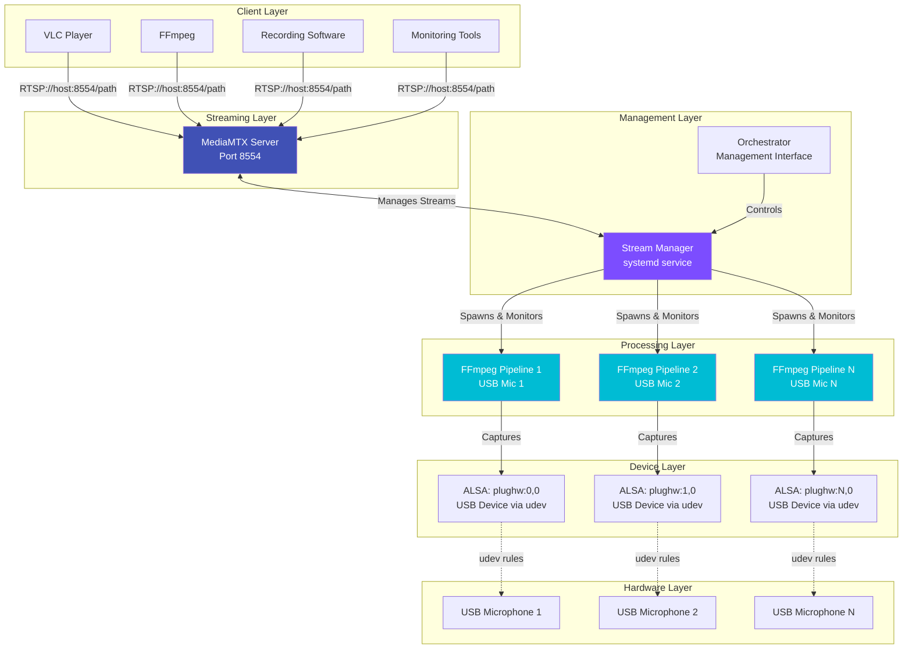

# LyreBirdAudio

**Production-hardened RTSP audio streaming suite for USB microphones with 24/7 reliability.**

Transform USB microphones into reliable RTSP streams for continuous monitoring and recording. Built on MediaMTX with automatic recovery, device persistence, and comprehensive diagnostics for unattended operation.

[Get Started](getting-started/quick-start.md){ .md-button .md-button--primary }
[View on GitHub](https://github.com/tomtom215/LyreBirdAudio){ .md-button }

---

## Key Features

<div class="grid" markdown>

<div markdown>
### No Configuration Guesswork
Automatically detects hardware capabilities and optimal settings for your USB audio devices.
</div>

<div markdown>
### Survives Reboots
USB devices maintain consistent names via udev rules. No manual intervention after system restarts.
</div>

<div markdown>
### Self-Healing
Automatic recovery from crashes and failures. Built-in watchdog ensures streams stay alive.
</div>

<div markdown>
### Easy Updates
Git-based version management with rollback capability. Update or revert with simple commands.
</div>

<div markdown>
### Production-Ready
Designed for unattended 24/7 operation with comprehensive logging and monitoring.
</div>

<div markdown>
### Real-Time Streaming
Low-latency RTSP streams compatible with VLC, FFmpeg, and all standard RTSP clients.
</div>

</div>

---

## System Architecture



---

## Quick Example

Transform a USB microphone into an RTSP stream in minutes:

```bash
# Clone the repository
git clone https://github.com/tomtom215/LyreBirdAudio.git
cd LyreBirdAudio

# Run the orchestrator wizard
sudo ./lyrebird-orchestrator.sh

# Follow the interactive prompts to:
# 1. Install MediaMTX
# 2. Map USB devices to persistent names
# 3. Create and start streams
# 4. Install systemd service for auto-start
```

Access your stream:

```bash
# Using VLC (stream name depends on your device naming)
vlc rtsp://localhost:8554/Device_1

# Using FFmpeg
ffmpeg -i rtsp://localhost:8554/Device_1 -acodec copy output.aac
```

---

## Platform Support

<div class="grid" markdown>

<div markdown>
### Linux
Full support for Ubuntu, Debian, Raspberry Pi OS, and derivatives
</div>

<div markdown>
### Architectures
**x86_64** · **ARM64** · **ARMv7** · **ARMv6**
</div>

</div>

---

## Use Cases

**Wildlife Monitoring**
: Continuous audio recording of bird activity and natural sounds with automatic failover

**Security Systems**
: Multi-microphone RTSP streams integrated into surveillance infrastructure

**Environmental Research**
: Long-term acoustic monitoring with reliable 24/7 operation

**Audio Distribution**
: Distribute USB microphone audio to multiple clients via standard RTSP protocol

---

## Project Origin

Originally developed for backyard bird activity monitoring, LyreBirdAudio evolved into a production-grade streaming solution. The system has been battle-tested in continuous 24/7 operation, handling USB device hotplug events, system reboots, and automatic recovery without manual intervention.

[Learn More About the Project](about/project-origin.md)

---

## Components

LyreBirdAudio is built from specialized components that work together:

| Component | Purpose | Documentation |
|-----------|---------|---------------|
| **Orchestrator** | Unified management interface | [Details](components/orchestrator.md) |
| **Stream Manager** | Stream lifecycle and recovery | [Details](components/stream-manager.md) |
| **USB Audio Mapper** | Device persistence via udev | [Details](components/usb-audio-mapper.md) |
| **Capability Checker** | Hardware detection | [Details](components/capability-checker.md) |
| **Diagnostics Tool** | System health monitoring | [Details](components/diagnostics.md) |
| **Version Manager** | Git-based updates | [Details](components/version-manager.md) |
| **MediaMTX Installer** | Server deployment | [Details](components/installer.md) |

---

## Getting Help

- **Quick Start Guide:** [Getting Started](getting-started/quick-start.md)
- **Troubleshooting:** [Common Issues](advanced/troubleshooting.md)
- **Report Issues:** [GitHub Issues](https://github.com/tomtom215/LyreBirdAudio/issues)
- **Discussions:** [GitHub Discussions](https://github.com/tomtom215/LyreBirdAudio/discussions)

---

## License

Licensed under the [Apache License 2.0](about/license.md) - permissive open source license allowing commercial use.
